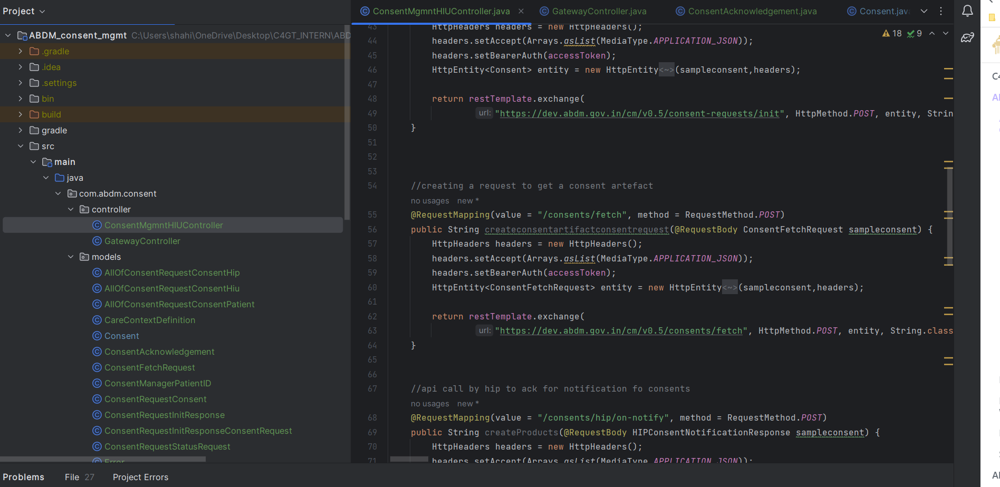
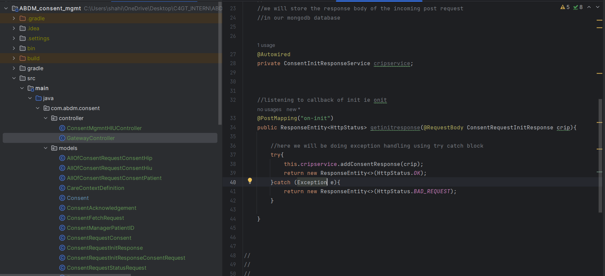

## Milestones
- [x] trying to connect springboot project to mongodb (nosql database)
- [x] be able to test consent management specific endpoints using accesstoken credentials
- [x] prepare for the demo showcasing
- [x] started learning about unit testing in springboot to apply the same in the project
- [x] started developing the code for springboot for calling and listening to abdm callbacks

## Screenshots / Videos 
springboot template that was connected to mongodb database
over code for hitting abdm consent apis 
overall code for listening to abdm callbacks

 hitting abdm endpoints 
 

listening to abdm callbacks

## Contributions
slides
https://docs.google.com/presentation/d/1iMC02-YU2Il7axMkAfo5h1kraCxnVfNa/edit?usp=sharing&ouid=110092494151519332497&rtpof=true&sd=true

## Learnings
- knowdledge about springboot unit testing
- ngrok for establishing bridge url
- the supermentor in the C4GT midpoint evaluation suggested to get a bigger scope of the project and make it as much as impactful as possible 
