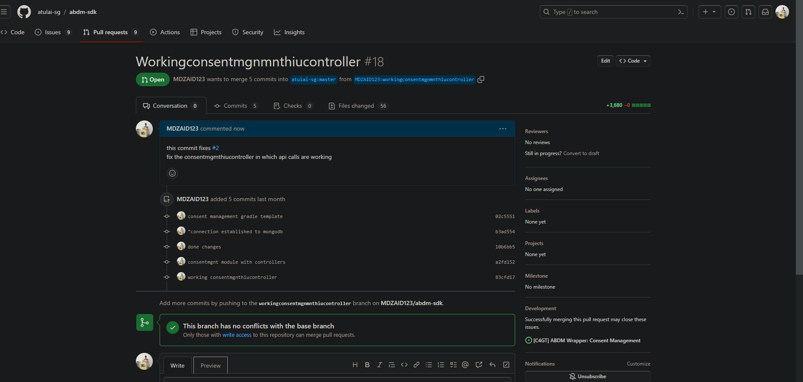
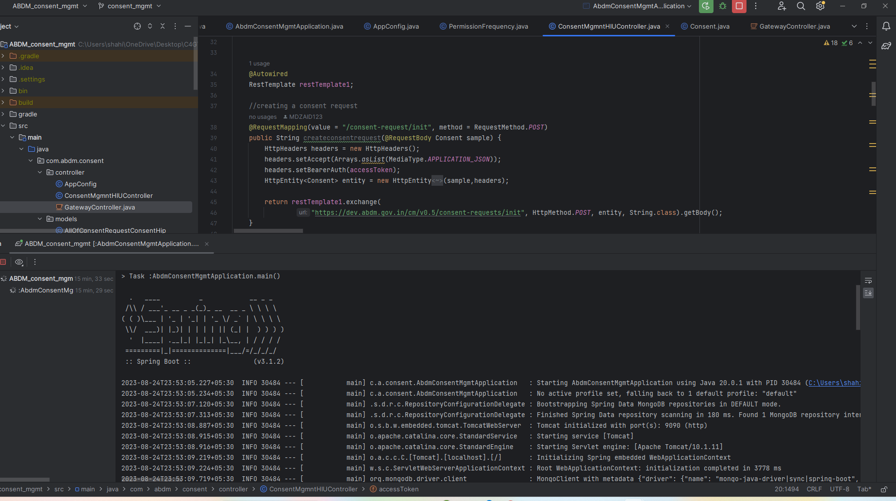

## Milestones
- [x] used and tried Bahmni both as HIU and HIP
- [x] Made Hiucontroller working by making it hit endpoints locally
- [x] almost completed the gateway controller code implementation
- [x] Finished Testing of all the consent apis in postman

## Screenshots / Videos 

Linked patients record using Bahmni EMR 
Care context response in app

## Contributions
PR -https://github.com/atulai-sg/abdm-sdk/pull/18

## Learnings
- explored Bahmni as an HIU as well as HIP
- ALSO THERE IS EMR PORTAL FOR THE SAME
- learning about swagger tools for API documentation

