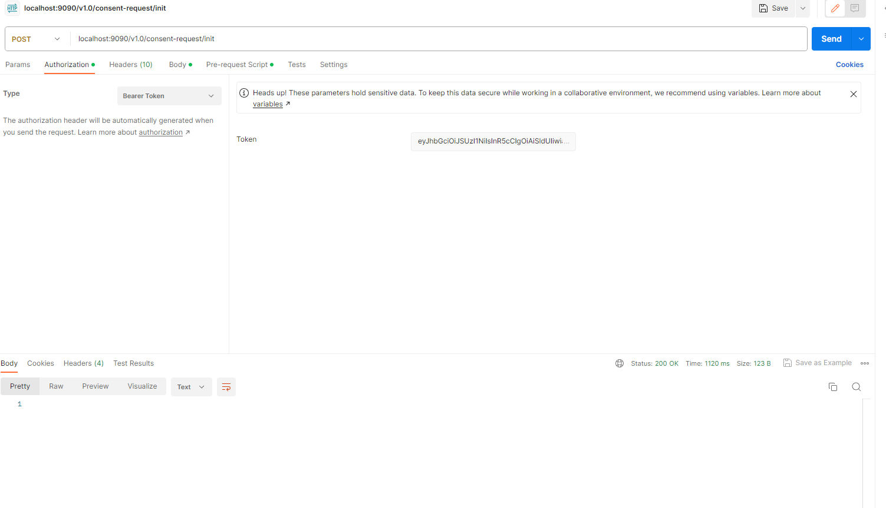
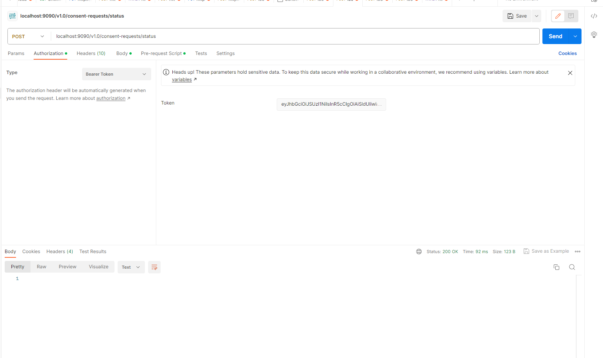
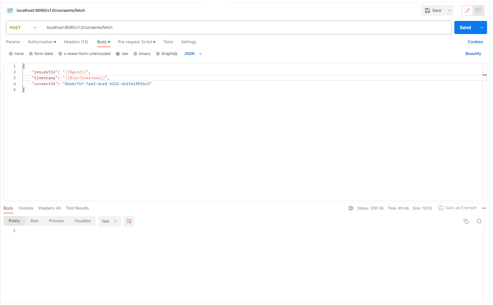

## Milestones
- [x] removed bugs fromm the consentmanagement hiu controller
- [x] Done with all the Consent Management Api testing through postman and got the details in ABHA sbx app
- [x] started working on the Architecture on how to store the consent artefacts that we will get by fetch api in mongodb
- [x] later when a request will be made we will look for it locally in the db and if not found then only we will intiate the api call from the springboot application ie consentmgmnghiucontroller

## Screenshots / Videos
init
 
status

fetch

## Contributions
https://github.com/atulai-sg/abdm-sdk/pull/21

## Learnings
how to fix bugs related to api calls in sprinboot
how to redirect callbacks to localhost service by creating a tunnel using ngrok 