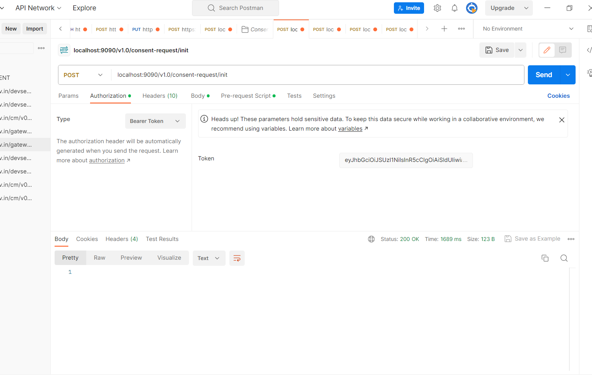
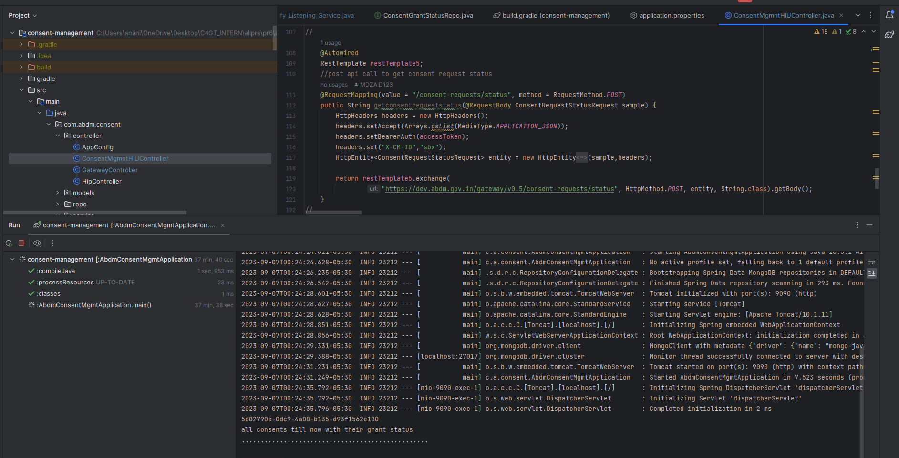

## Milestones
- [x] Completed the major Milestones for building hiu controllers and gateway controllers ,hip controller for consent managament module for calling endpoints
- [x] Completed the Unit Testing and Api testing for the HRP API
- [x] got code reviewed by mentors and made the required changes

- [x] Added Readme file for easy understanding for future work on the same module
- [x] Note-our project ABDM consent managment is build from scratch in C4GT 2023 So future work will also be done on these ABDM  MODULES

## Screenshots / Videos

## Contributions
All PULL REQUEST linked (in the new GitHub repo created by Mentor)
Github repo for ABDM wrapper-https://github.com/atulai-sg/abdm-wrapper
PR1-https://github.com/atulai-sg/abdm-wrapper/pull/14 .
PR2-https://github.com/atulai-sg/abdm-wrapper/pull/15
PR3-https://github.com/atulai-sg/abdm-wrapper/pull/16
PR4-https://github.com/atulai-sg/abdm-wrapper/pull/17
PR5-https://github.com/atulai-sg/abdm-wrapper/pull/18
PR6-https://github.com/atulai-sg/abdm-wrapper/pull/19

## Learnings

My overall C4GT learning experience was amazing
got to learn from diff mentors 
our project ABDM consist of 3 mentors
the importance of iterative development and continous feedback is important in open source 
learned about Mongodb connections to Springboot 
Learned about PR code reviews 
Learned how to write effective documentation for open source work to be continued by some other folks in future 
Overall technical learning for me was about open source ,git github,api testing Postman,Springboot,Mongodb,RestApi,Webhook,SSH TUNNELS,ngrok,code reviews,CI/CD

