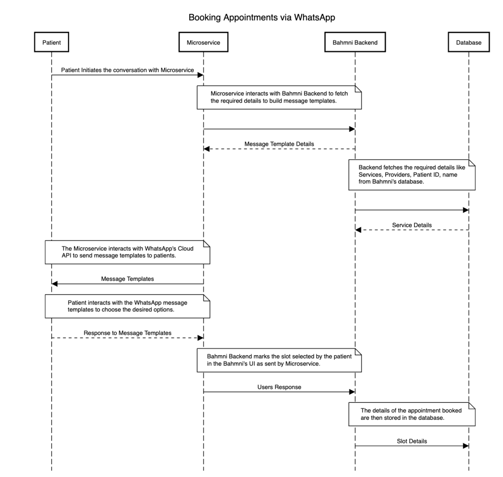

## Milestones
- [ ] The Bahmni Community was introduced and the project timeline was refined with the mentors based on the updated requirements and implementation flow of the feature. 
- [ ] A Concept Note was prepared to conceptualize the feature details and scope for the community and other stakeholders. 
- [ ] A High-Level Architecture was prepared for the implementation of the Microservice and it was updated based on feedback from the mentors.
- [ ] Mock-Ups (lo-fi) designs were prepared for the possible implementations of the appointment booking feature. Feedback was gathered from the community and a common ground was reached to start the development of the Microservice. 

## Screenshots / Videos 
High-Level Architecture:

## Contributions
Proposed Figma Designs For the Message Templates: https://www.figma.com/file/6OZBU9SWpaAvNXzs6CDZTc/WhatsApp-Message-Templates?type=design&node-id=419%3A607&mode=design&t=EeIOSYjCgbzft9N7-1

Link to the Concept Note: https://docs.google.com/document/d/1LhE7MDXXxhUo9HEYU30qXkwRlLGa0yov5z_tpjE4Upc/edit?usp=sharing

## Learnings
1. One of my most valuable insights was gaining first-hand experience in observing and participating in the collaborative processes of an open-source community. Witnessing their ideation and collective efforts to create products with far-reaching impact was truly enlightening.

2. I learned the significance of breaking down a feature into smaller, manageable stories. This approach allows for focused attention on each individual story, enabling the gradual construction of the overall feature.

3. Another crucial lesson was developing the ability to think strategically and create a high-level architecture for the proposed Microservice. This involved considering various factors, such as scalability, performance, and integration, to design a robust and well-structured system.