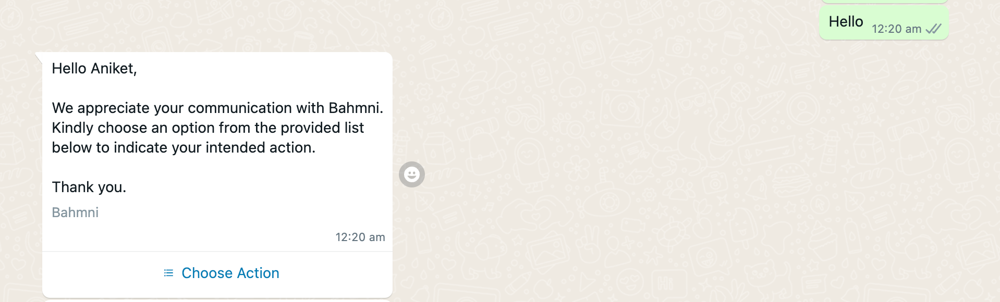
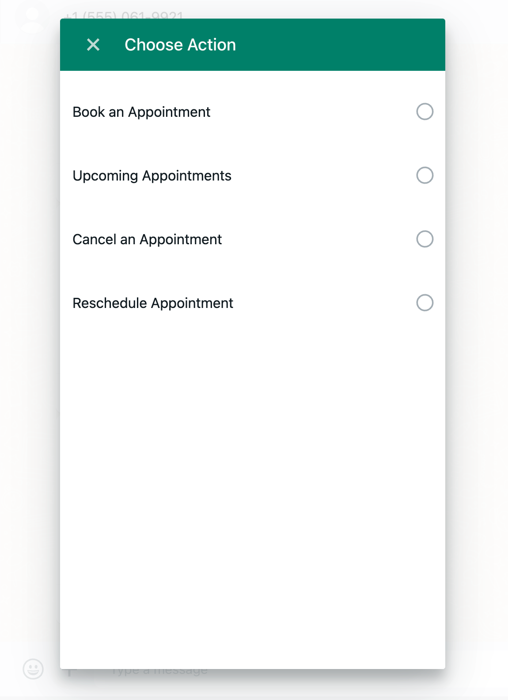

## Milestones
- [ ] Retrieved Patient details using unique identifier
- [ ] Created an HTTPClient that fetches the JSession ID using OpenMRS login authenticator
- [ ] Created new message template that greets Patients and ask them to choose an action

## Screenshots / Videos 

## Contributions

PR raised: [link](https://github.com/Bahmni/whatsapp-bahmni-service/pull/3)

## Learnings
1. Learnt how to remove failed downloads in maven to add dependencies after reloading the project
2. Learnt about switching to a different java version for an existing project
3. Learnt running a java project using a debugger and leveraging it to debug the project