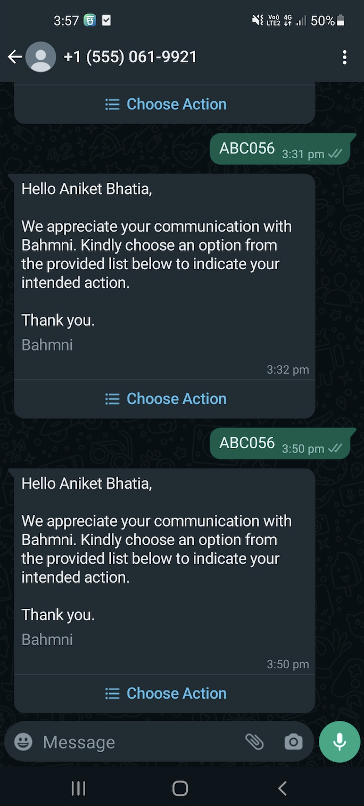

## Milestones
- [ ] Switched to using FHIR API endpoints to fetch the patient details
- [ ] Refactored the code to increase modularity and reduce code smells
- [ ] Started with implementation of flow for Service Message Templates

## Screenshots / Videos 

## Contributions
PR: [link](https://github.com/Bahmni/whatsapp-bahmni-service/pull/4)

## Learnings
1. Learnt about code smells and refactoring code 
2. Explored FHIR APIs
3. Using curl commands to make request to API endpoints in Postman