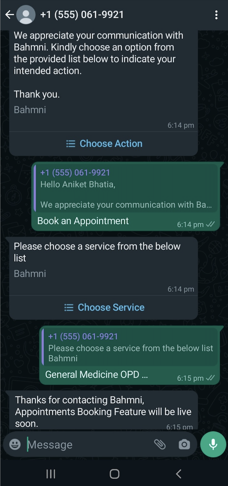
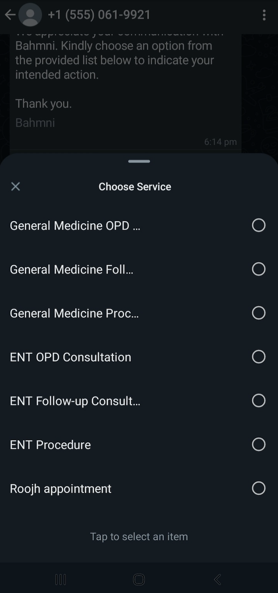

## Milestones
- [ ] Replaced the Bahmni API endpoint with HAPI FHIR API endpoint to fetch the Patient Resource
- [ ] Completed the Implementation of Service Message Templates
- [ ] Started with implementation of Appointments Date and Time templates to be sent next in the flow
- [ ] Refactored the code further to increase modularity

## Screenshots / Videos 

## Contributions

## Learnings
1. Learned about configuring the RestTemplate in Spring Boot Applications
2. Learned how to pull data from OpenMRS for FHIR endpoints
3. Learned about how Annotations in Java are used for dependency injection