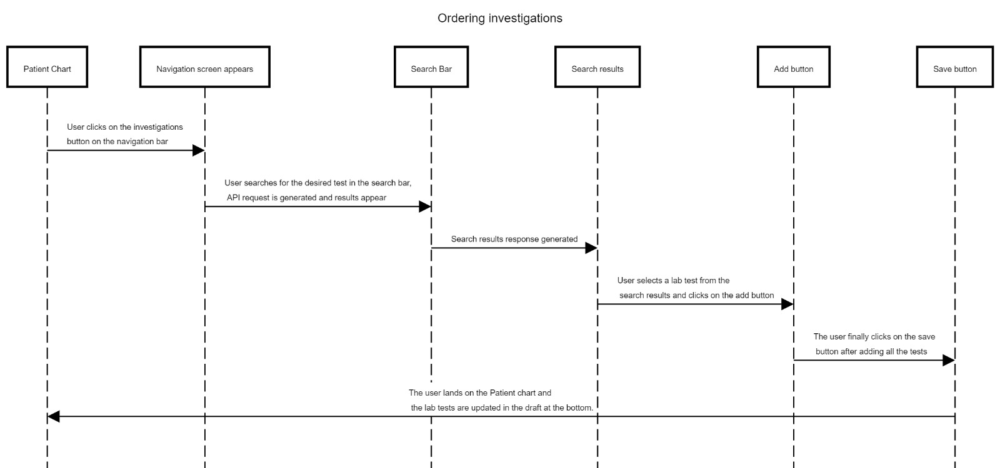

## Milestones

- Setting up the Connect2Bahmni app locally on my own
computer, setting up the server locally using the bahmni lite docker version and setting up the Android Studio.
- Preparing high level architecture on how the feature should work.
- Started working on the JIRA stories and breaking the features into smaller user stories.
- Preparing a roadmap with the help of the mentors to proceed
with the starting of the project and completing the project.

## Screenshots / Videos
High-Level Architecture:

1.Investigations

2.Medications

## Contributions

## Learnings

- Learnt how to work with docker and learnt about docker images and containers.
- Learnt how to break big features into smaller user stories.
- Learnt how to prepare sequence diagrams under the high level architecture.