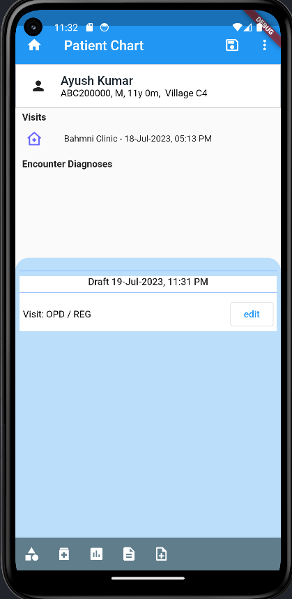
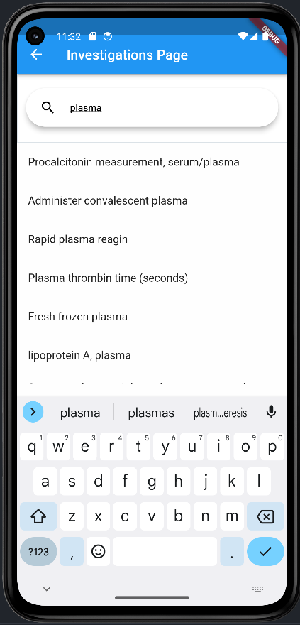
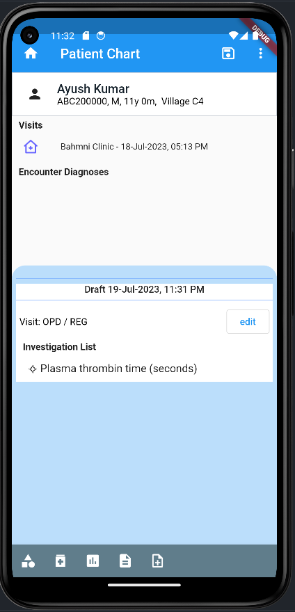
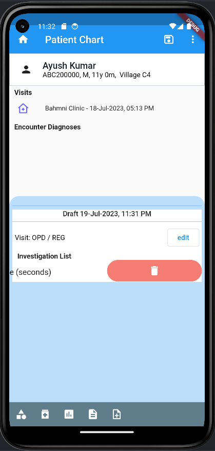

## Milestones
- Worked on the Investigation feature of the app.
- Understood the overflow more clearly and bulit the Investigation screen where the user can search for a particular lab test.
- Submitted my first pull request and worked on the alterations requested by the maintainer. 

## Screenshots / Videos 
Screenshots:

## Contributions
- Link to my PR: https://github.com/Bahmni/connect2Bahmni/pull/12

## Learnings
- Polished my skills by making the Investigation Screen.
- Learnt how to make API calls and read API responses and use them
- Learnt how to submit PR on github.