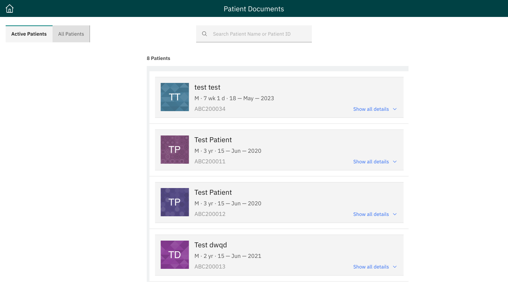
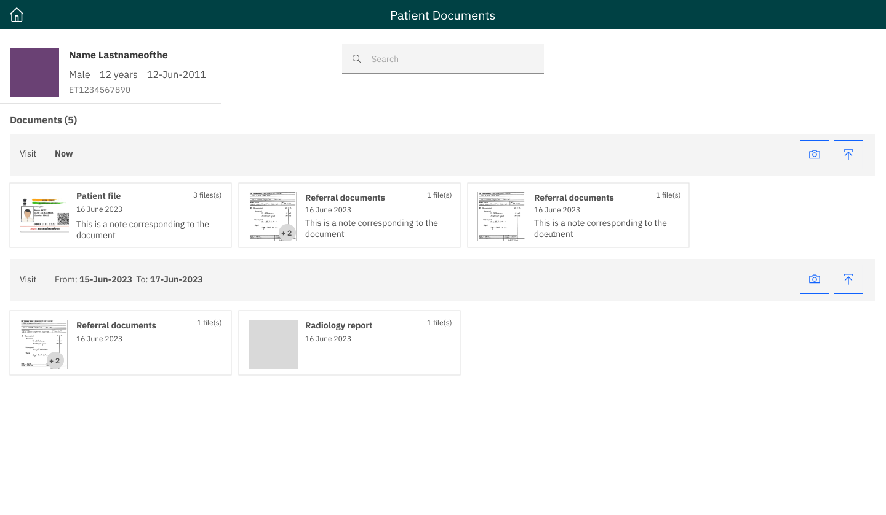

## Milestones
- Discussion with Core UI team Members and Product Manager for the UI design of the project.
- Finalize the Figma Design with the team.
- Mentors told to work with Nupoor Shetye(who is working on the Patient Portal Project), so After her first PR I can Fork the repo and work on it. This help to use the same Dependencies for the Project.
- Currently Learning Jest and react testing Library for helping out to her for the Unit test cases.

## Screenshots / Videos 
Basic UI Design of the Project:

1.Showcase of the Active Patients

2.Dashboard of a Patient

## Contributions
JIRA Ticket: https://bahmni.atlassian.net/jira/software/c/projects/BAH/boards/46?modal=detail&selectedIssue=BAH-3089
## Learnings
- Learn how to Design the UI design on Figma.
- Learned how to write the Unit Test cases.
- Learn the New Libraries like Jest and React-Testing Library.
- Learned Collaboration with the core Team Members to work on a Single Thing.
