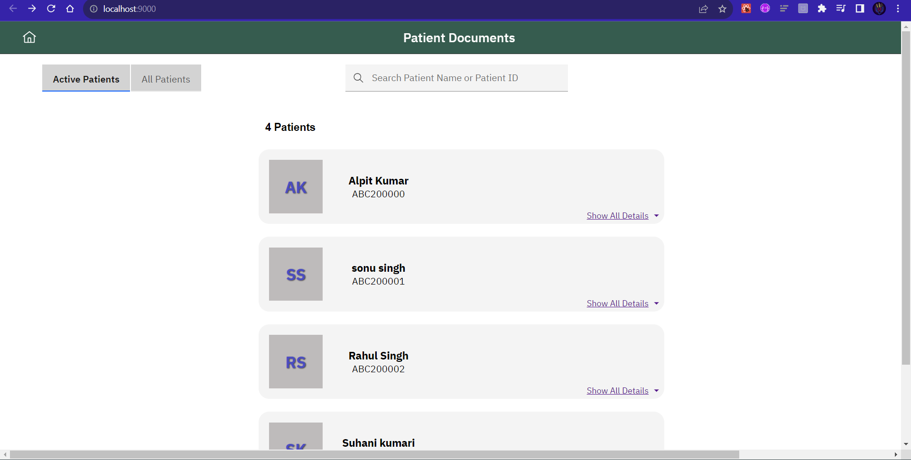
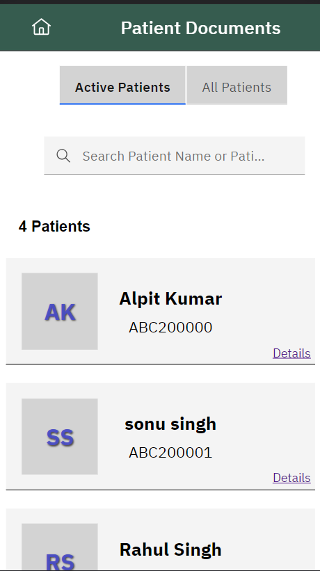
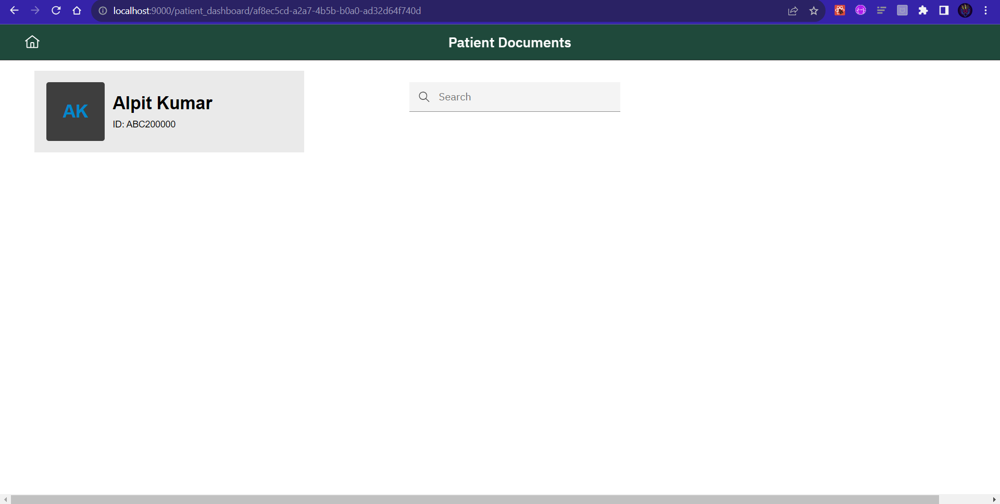

## Milestones
- Resolve the review for the UI of the First Page.
- Connect the Patient Dashboard to the Main Page.
- Design the Basic UI for the Patient Dashboard.
- Understanding the API's fetched in the Document Upload Page.

## Screenshots / Videos 

## Contributions
[PR Raised](https://github.com/Bahmni/patient-doc-upload-frontend/commit/239ed7697caa1b7f14a903b275e1fc8db8b9e84a)

## Learnings
- Learn the Router to Connect with the Different Pages in React.
- How to write the Readable and Maintainable code.
- Learn How to write the Code in Components.