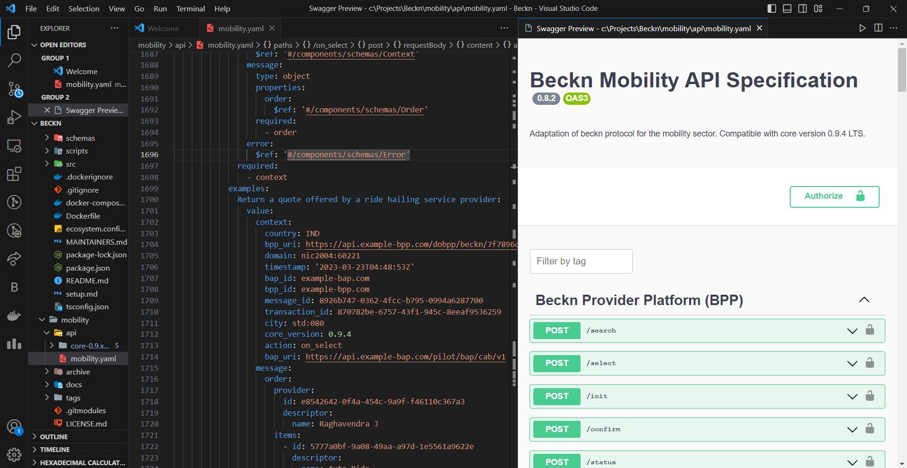

## Milestones
- [ ] Understood the Beckn Mobility interface
- [ ] Went through the yaml files of the protocol server which is the base of mobility
- [ ] Setting up development environment(ticket attached at the bottom)
- [ ] Working on the use cases as mentioned in the issue ticket tagged below.

## Screenshots / Videos 

## Contributions
- 🟢 https://github.com/beckn/mobility/issues/56
- 🟡 https://github.com/beckn/mobility/issues/57

**Closed :** 🟢    **In Progress :** 🟡 

## Learnings

- [ ] How mobility works over the protocol core server
- [ ] Identifying new use cases of the beckn mobility protocol
