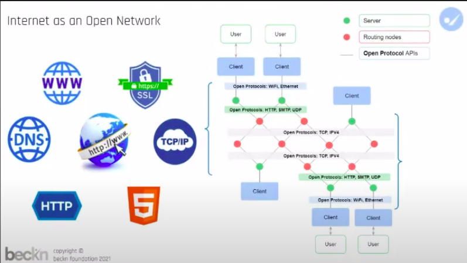
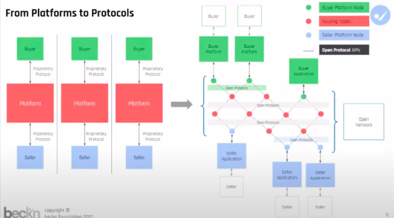

## Milestones

### [Understanding beckn protocol](https://github.com/beckn/beckn-in-a-box/issues/10)

- [x] Understood **BeckN** Protocol and its API Specifications in depth.
- [x] Attended **BeckN** overview sessions by C4GT.

## Screenshots / Videos

## Learnings

- BeckN Protocol
- Protocol Specifications
- Beckn Sandbox
