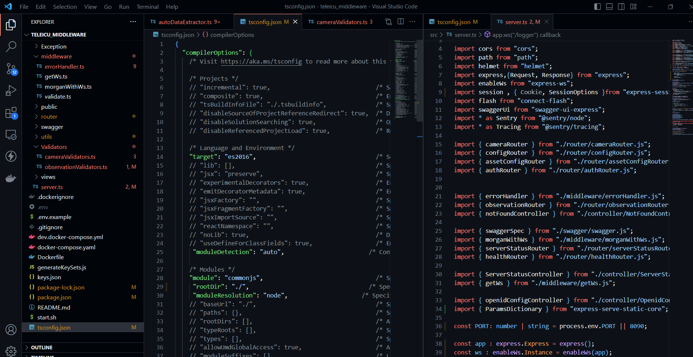

## Milestones
- [x] Learning and understanding the codebase
- [x] Setup the development environment for the middleware
- [x] Configured the Typescript Compiler
- [x] Changed the file extenstion to .ts

## Screenshots / Videos 
- Typescript compiler config

## Contributions
- [Pull Request](https://github.com/coronasafe/teleicu_middleware/pull/74)

## Learnings
1. Learned about the codebase
2. Learned about various methods in which typescript compiler can be configured
