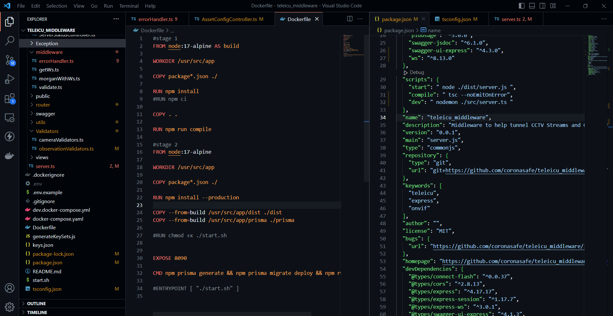

## Milestones
- [x] Dockerized the middleware using multistage build 
- [x] Updated the scripts in Package.json file

## Screenshots / Videos 
- Multistage docker build

## Contributions
- [Pull Request](https://github.com/coronasafe/teleicu_middleware/pull/74)

## Learnings
1. Learnt to use Dockers
2. Learnt to dockerize applications