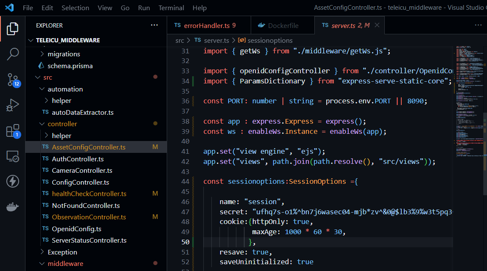

## Milestones
- [x] Added typesafety to main file in the middleware
- [x] Implementing Assest status property to listassest endpoint

## Screenshots / Videos 
- Typesafety to files

## Contributions
- [Pull Request](https://github.com/coronasafe/teleicu_middleware/pull/74)

## Learnings
1. Learnt about crud operations
2. Learnt about Prisma ORM