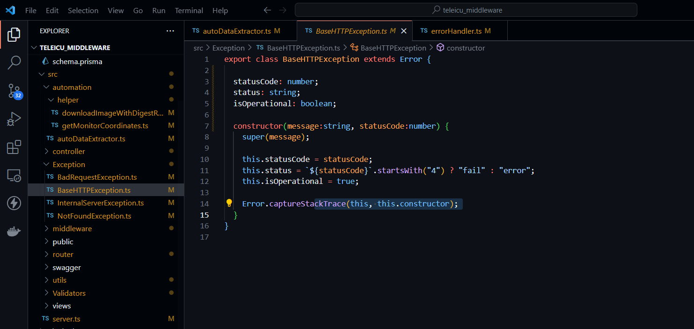

## Milestones
- [x] Added typesafety to ./Validators
- [x] Fixed several interface error

## Screenshots / Videos 
- Typesafety to files
- 

## Contributions
- [Pull Request](https://github.com/coronasafe/teleicu_middleware/pull/74)

## Learnings
- Learnt about using interfaces and creating unions using interfaces