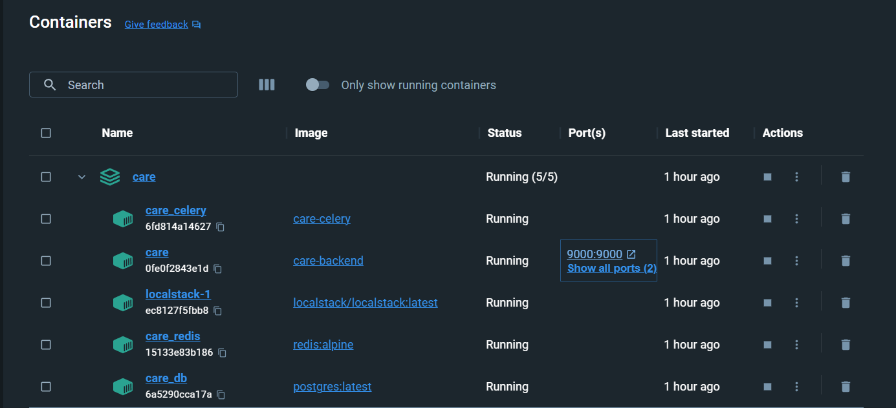
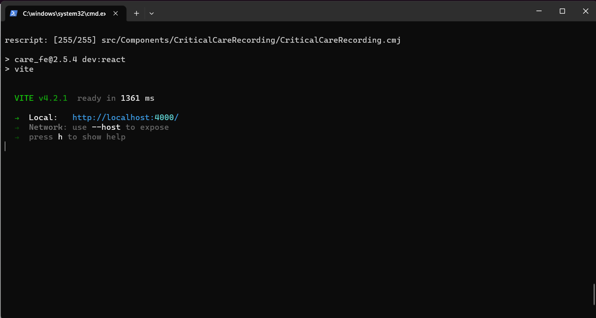
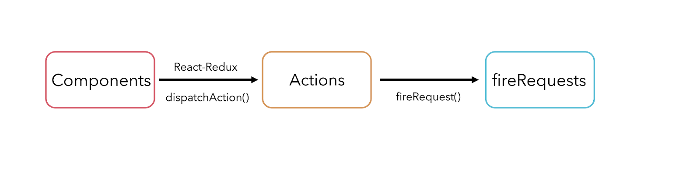

## Milestones
- [x] Project Setup and Running on Local Machine.
- [x] Understand the requirements of the project with the mentor and discuss a solution.
- [x] Map out the data flow

## Screenshots / Videos 

- Setup the Backend and the Frontend Instance. Also configured the Frontend to use the local backend server for changes.

- Data Flow for the Frontend API requests.

## Contributions

- [Add list and detail serializer to facility_asset module #1427](https://github.com/coronasafe/care/pull/1427) 

## Learnings

- I only made one contribution in this period but I feel like that was the biggest barrier in the project and I overcame that. My first PR had a lot of issues, I made some mistakes in the Version Control, didn't write tests etc. 

- After my first PR got approved I knew the rest of the project is going to be better, as I can apply all the learnings from my first PR immediately to my consecutive PRs

- I don't have much knowledge about React and its components. So, I brushed up on the basics of Hooks like useState, useEffect, useReducer and Redux and its actions. All these had to be learnt to identify areas in the backend that lead to stale data (**data which was not being used**).