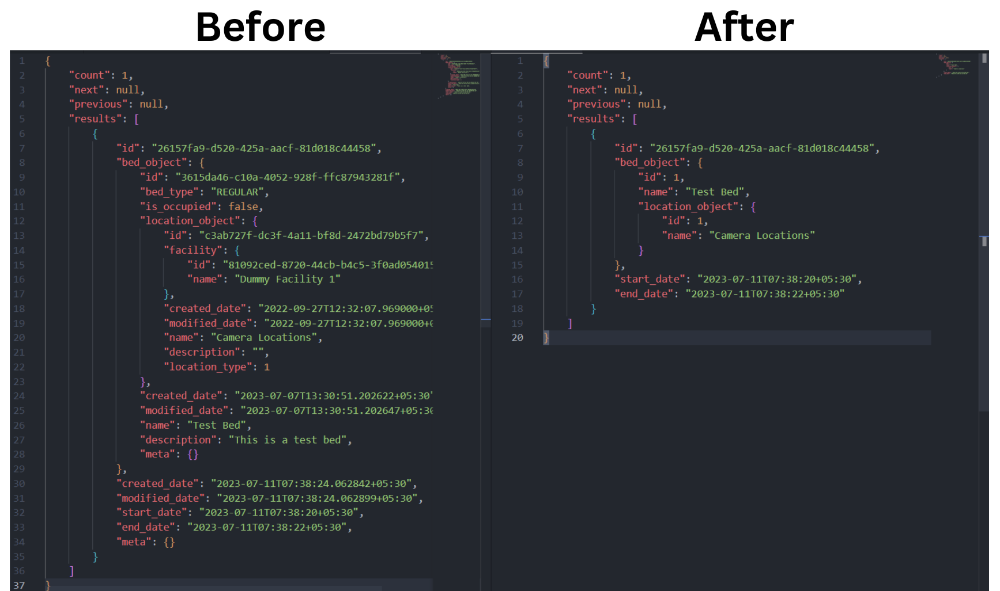

## Milestones
- [x] Convert on facility module to List and Detail Serializer

## Screenshots / Videos

- Before and After converting to List and Detail Serializer

## Contributions

- [Add list and detail serializer to facility_asset module #1427](https://github.com/coronasafe/care/pull/1427)

## Learnings

- I only made one contribution in this period but I feel like that was the biggest barrier in the project and I overcame that. My first PR had a lot of issues, I made some mistakes in the Version Control, didn't write tests etc. 

- After my first PR got approved I knew the rest of the project is going to be better, as I can apply all the learnings from my first PR immediately to my consecutive PRs