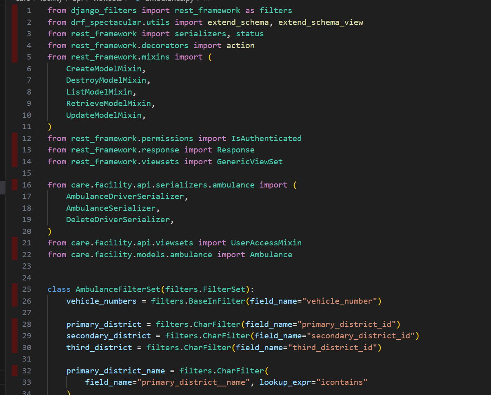

## Milestones
- [x] Learn more about test coverage
- [x] Learn about extenstions that can be used to improve test coverage

## Screenshots / Videos 

- Test Coverage using Coverage Gutters

## Contributions

## Learnings

- Learned about test coverage and internal working of how test coverage works

- Learned about extensions that can be used to improve test coverage

- Learnt about validation tests and how to write them which can be used to improve test coverage