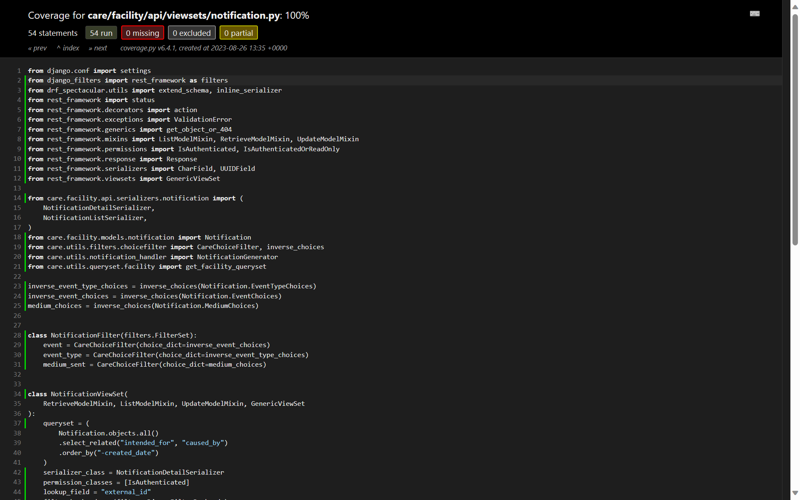

## Milestones
- [x] Complete Facility - patient_icmr.py module
- [x] Complete Facility - resources.py module
- [x] Complete Facility - shitfing.py module
- [x] Complete facility - patient_external_test.py
- [x] Complete one module with full coverage

## Screenshots / Videos 

## Contributions
- [Patient ICMR Module](https://github.com/coronasafe/care/pull/1543)
- [Resources Module](https://github.com/coronasafe/care/pull/1548/files)
- [Shifting Module](https://github.com/coronasafe/care/pull/1549)
- [Prescription Module](https://github.com/coronasafe/care/pull/1555/)

## Learnings
- Worked one module [module](https://github.com/coronasafe/care/pull/1531), to add 100% coverage for tests.
- Learn about coverage package of python and how to use it effectibely in IDE to test which lines of code is not tested and write tests for them.