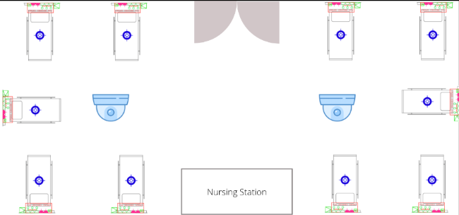

# Author
Jahnab Dutta

# Contact Info
- [Email](mailto:dutta.4@iitj.ac.in)
- [Linked In](https://www.linkedin.com/in/jahnab-dutta/)
- [GitHub](https://github.com/JahnabDutta/)

# Project Description

The project aims to enchance the already existing camera feed feature of CARE. The camera feed connnects rural patients with urban doctors who are able to monitor the vitals, face and other parameters of the patient. The suggested camera set up according to 10BedICU is given in the following image. One single camera would over see 5 or 6 patient beds. The proposed enhancements aim to provide doctors with improved control and collaborative capabilities while viewing patients remotely.

The project aims to include features like:
- **Boundary-Based Camera Visual**: Implement a pre-fixed boundary on the XY axis to limit camera movement per patient, ensuring focused viewing within specific areas for accurate diagnosis.
- **User Notification for Concurrent Viewers**: Notify users when another viewer is already accessing the camera feed for a patient, promoting better coordination and reducing interruptions.
- **Request Camera Toggle Access**: Allow users to request temporary camera access from the current viewer, fostering collaboration and efficient resource utilization.
- **Privacy Control Alert**: If a patient has privacy control enabled, doctors will receive an alert indicating the privacy control status. They will be advised to contact hospital staff for assistance in removing the privacy control and once removed only, the doctor should be able to access the patient's camera feed.
