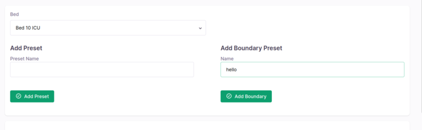

## Milestones
- [x] Project set up.
- [x] Implement addition of boundary preset, unique to each patient bed.
- [x] Implement frontend and validation camera movement within the boundary.

## Screenshots / Videos

## Contributions

- ### Changes
    - Feature to add static boundary preset to a patient bed.
    - Basic UI to add boundary preset by the user and provide it's name.
    - Frontend validation feature to check if the camera movement is within the boundary.
    - Add backend validation to add extra layer of security in camera movement.

- ### Issues
    - [Boundary-Based Camera Visual under Live Camera Feed Enhancement](https://github.com/coronasafe/care_fe/issues/5871)

- ### Commits
    - [add boundary preset functionality](https://github.com/coronasafe/care_fe/pull/5874/commits/3a81d93d114d98913ee9151b5667ef0a26db6552)
    - [Backend-realative Move Validation](https://github.com/coronasafe/care/pull/1453/commits/eacf4e60df02e77ac78deb7e7d909640b287950a)

## Learnings
- Learnt about docker during set up phase. Learnt about how to run project and use containers from command line itself.
- Learnt how to efficiently use typescript with React and type check props for easier debugging.
- Learnt basics of tailwind css and how to use it with React.
- Learnt about mixins and permissions in Django.
