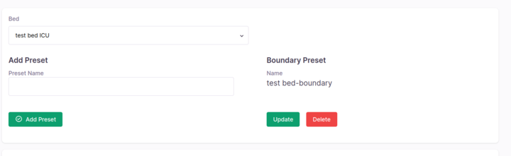

## Milestones
- [x] Add functionality to update and delete boundary preset.
- [x] Imporve UI for updating functionality.
- [x] Implement algorithm to calculate boundary preset based on point presets.

## Screenshots / Videos 
- 

## Contributions

- ### Changes
    - Implement feature to delete boundary preset by the user.
    - Implement feature to modify boundary preset by the user.
    - Make initial UI for updation and deletion.

- ### Issues
    - [Boundary-Based Camera Visual under Live Camera Feed Enhancement](https://github.com/coronasafe/care_fe/issues/5871)

- ### Pull Requests
    - [Add boundary Preset-frontend](https://github.com/coronasafe/care_fe/pull/5874/)
    - [Add boundary based validation-backend](https://github.com/coronasafe/care/pull/1453)
- ### Commits
    - [Boundary Preset updation and deletion functionality](https://github.com/coronasafe/care_fe/pull/5874/commits/eacf431e66b44d765cfc435438d914ff96871790#diff-1d65a996f952fb6cd0b8721be6e07b3b0bc719c35adb7ddd256b3e550a02a7db)
    - [Boundary Preset updation and deletion UI](https://github.com/coronasafe/care_fe/pull/5874/commits/eacf431e66b44d765cfc435438d914ff96871790#diff-4517a33ce1a572a5f42ab83614221af725ed198498d988a72c42dc2cbe8a18c5)
    - [Modification of payload to operate_assets API for backend validation](https://github.com/coronasafe/care_fe/pull/5874/commits/eacf431e66b44d765cfc435438d914ff96871790#diff-5720f1345a51b321a7409e05b9acc257c75783e165427270755ecc0626e59cb2)
    - [Add algorithm for boundary calculation](https://github.com/coronasafe/care_fe/pull/5874/commits/36a2718feb83a9fdb354e3138a6ab5795a4efa5f)
    - [Add feature to go to a directional boundary and expand/shrink for boundary update](https://github.com/coronasafe/care_fe/pull/5874/commits/d0dd9a470a88a63e0485946154e5dff8d6f2d533)
    - [Move backend validation to proper folder](https://github.com/coronasafe/care/pull/1453/commits/4f0f3d6896562facf8734c43c43febf133bc0069)

## Learnings
- Brushed up geometry to create algorithm for boundary calculation, specially properites of triangles.
- Learnt how to use the network tab in browser to debug API calls.
- Learnt about various ways to implement flex in tailwind css such as `flex-1` and `flex-inline` etc.
- Learnt how the dispatch function works in React-Redux and how to use it to update state.
