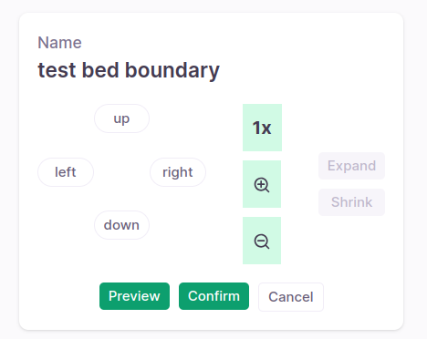

## Milestones
- [x] Make UI for updating boundary compatible and responsive
- [x] Refactor CameraConfig component into LiveFeed Screen to make LiveFeed specific to the particular bed
- [x] Implment mutex lock for assets in backend

## Screenshots / Videos 
- 

## Contributions
- ### Changes
    - Use flex to make the update boundary preset UI responsive.
    - Fix position of the update boundary preset UI.
    - Implement scroll feature to scroll down to update boundary preset UI.
    - Make `CameraConfig` component part of the `LiveFeed` screen.
    - Import bed presets from the backend based on specific and specific asset instead of just specific asset.
    - Design prototype for the new LiveFeed screen.
    - Implement mutex lock for assets in backend using Django caching for in memory storage of the lock status.
- ### Issues
    - [User Notification for Concurrent Viewers under Live Camera Feed Enhancement](https://github.com/coronasafe/care_fe/issues/5892)
- ### Pull Requests
    - [Lock asset feature](https://github.com/coronasafe/care/pull/1467)
- ### Commits
    - [Make update boundary preset UI responsive](https://github.com/coronasafe/care_fe/pull/5874/commits/886bdf4dc6d9bc8bb146e6ee4c83c8dd4a6be00d)
    - [Implement scroll](https://github.com/coronasafe/care_fe/pull/5874/commits/5b484322cff3fb5dcc36c829658c157fe7fbbcf0)
    - [Refactor CameraConfig into LiveFeed](https://github.com/coronasafe/care_fe/pull/5874/commits/398bd4df723d35e47f7c1e65fe17d70121f61236)
    - [Lock feature feature backend](https://github.com/coronasafe/care/pull/1467/commits/91783b0d51ac530b98f09a47e94646c34dd7aceb)

## Learnings
- Learnt basics to figma to design a new UI for boundary preset update.
- Learnt about caching in Django and how to use it to implement mutex lock for assets.
- Learnt about atomic transactions.
- Learnt about the `useRef` hook in React to implement scroll feature.
