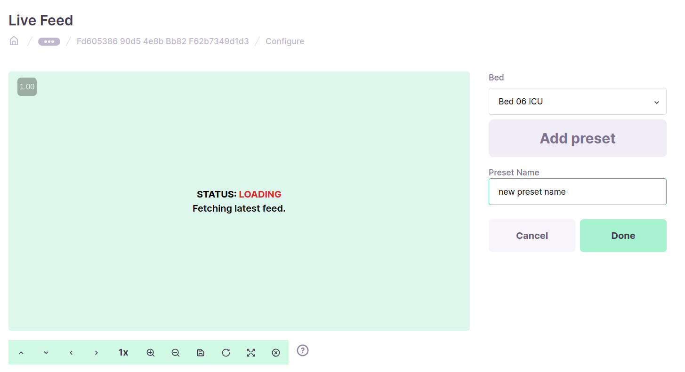
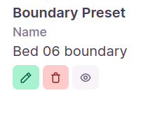
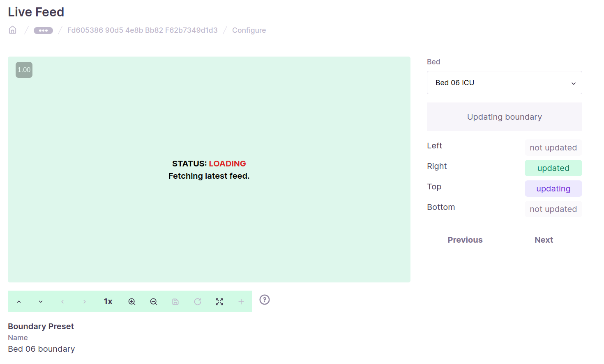

## Milestones
- [x] add lock-action for assets in backend
- [x] implement locking feature in the frontend
- [x] change UI to add point presets for live-feed screen
- [x] turn update boundary preet UI into a wizard
## Screenshots / Videos 
- 
- 
- 
## Contributions
- ### Changes
    - add action to lock assets in the `operate_assets` api in the backend.
    - add new functions in the `usePTZ` hook to use the `lock_asset` and `unlock_asset` api in the frontend.
    - Display username when another user is viewing the live-feed.
    - add new UI to add point presets for live-feed screen.
    - add new UI to view boundary preset for live-feed screen.
    - add new UI wizard to modify the boundary preset for live-feed screen.
- ### Pull Requests
    - [Add lock feature for assets](https://github.com/coronasafe/care_fe/pull/5967)
- ### Commits
    - [Add lock acton for assets](https://github.com/coronasafe/care/commit/11b772ab1f16b6689dc93a9e2c29825e32094a1d)
    - [Change lock type from using `user_id` as value to `username` as value](https://github.com/coronasafe/care/commit/11b772ab1f16b6689dc93a9e2c29825e32094a1d#diff-03cbb55124774d9e94cb7d0ed61bb24e1a86b5b82c929bc665d14ce1d1f2f212L64)
    - [Add lock and unlock functions in the `usePTZ` hook](https://github.com/coronasafe/care_fe/pull/5967/commits/d3657cf3275ac7539241dd5df108df3e511e2c71)
    - [Display Username when another user is viewing the live](https://github.com/coronasafe/care_fe/pull/5967/commits/d10864f57418284611d3b3d6ce31d236ccc9b16b)
    - [Add new UI to add point presets for live-feed screen](https://github.com/coronasafe/care_fe/pull/5874/commits/bba9658158106738b97d173193eb059b2d406ec8)
    - [Change UI for add-delete boundary](https://github.com/coronasafe/care_fe/pull/5874/commits/9936777a8b0e31255cb9341682d12ad47b9ad5f0)
    - [Create Wizard for update boundary preset UI](https://github.com/coronasafe/care_fe/pull/5874/commits/0fdd0743047e9bc4ad88c43ba9f7c095165c14f5)
## Learnings
- Learnt about making flow charts to visualize various scenarios for locking/unlocking assets by 2 or more clients.
- Learnt new ways to make UI
- ### Mid term demo
    - [presentation](https://docs.google.com/presentation/d/1FI6Ome3VI-6P95Vpwlo_wTzqIUFavCkb/edit?usp=sharing&ouid=114847827049693744870&rtpof=true&sd=true)
    - [Demo video](https://drive.google.com/file/d/1nSjGwWHGSjDG0Oz0sV4EpMDTFMl63jOv/view?pli=1)
    - Remark by super mentor: The frontend part is fine and should be updated with discussion with the team. In the locking asset feature, there should be some exploration made on using locks from the postgresql databse itself as it can be used to lock the transaction and make it atomic. Otherwise there may be conditions of deadlocks or race conditions.
    