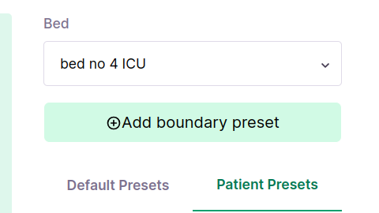
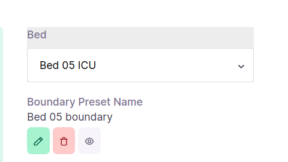

## Milestones
- [x] Finish up UI changes related to boundary preset
- [x] Start implementation of Patient Privacy feature

## Screenshots / Videos 
- 
- 

## Contributions
- ### Changes
    - Modify UI for addition of presets
    - Finish boundary UI modification
    - Add flashing animation for out of bounds movement
    - Ideate on how to implement patient privacy feature
- ### Commits
    - [Add red flash around border](https://github.com/coronasafe/care_fe/pull/5874/commits/34c47c5f149da964ef1b41bbf8946be6913eb97a)
    - [Disable bed select when previewing](https://github.com/coronasafe/care_fe/pull/5874/commits/c009835c74db2b539923de92fc81102d3a8774bc)
    - [UI changes](https://github.com/coronasafe/care_fe/pull/5874/commits/a39b73114fd325717b7defdbf562c6342490a361)

## Learnings
- Learnt how to make basic animations using 'keyframes' in CSS.
- Learnt how to add animations in tailwind config file.
- Learnt about CARE backend and facility models while ideating on how to implement patient privacy feature.