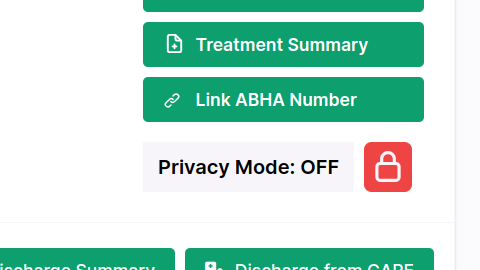

## Milestones
- [x] Create Patient Privacy Feature in frontend
- [x] Enforce Patient Privacy in backend
- [x] Write backend tests for patient privacy feature

## Screenshots / Videos 
- 

## Contributions
- ### Changes
    - Add Patient Privacy toggle in patient profile
    - Add Privacy page in place of camera screen when privacy is on.
    - Add conditional rendering of toggle button based on user role.
    - Add toggle access in backend based on user role.
    - Add tests for patient privacy feature.
- ### Pull Requests
    - [Patient Privacy Feature Frontend](https://github.com/coronasafe/care_fe/pull/6021)
    - [Paitent Privacy Feature Backend](https://github.com/coronasafe/care/pull/1518)
- ### Commits
    - [privacy functions in frontend](https://github.com/coronasafe/care_fe/pull/6021/commits/f032facb5bd12dbffb6f8da2faac9a21418048a3)
    - [Conditional rendering of `Feed` based on privacy status](https://github.com/coronasafe/care_fe/pull/6021/commits/983a96fec25693c18d817c2eaaa3dbf2d144c803)
    - [Change toggle for buttons and add tooltop](https://github.com/coronasafe/care_fe/pull/6021/commits/e4f4e6a630c6d2dac78b77b7d4ade08da8b2cbb0)
    - [Add privacy field in `consultationbed` model and make API for privacy toggle](https://github.com/coronasafe/care/pull/1518/commits/6b3b5017817afedaa2e595ccfbe935b61c418701)
    - [Privacy tests for different users](https://github.com/coronasafe/care/pull/1518/commits/32112442b0fc5fe4f2a562cbf48263d6ae047e33)

## Learnings
- Writing unit tests in backend for django.
- `useCallback` hook in react.
- API creation in `cookiecutter-django`.
- Changing default `Viewsets` in `cookiecutter-django`.