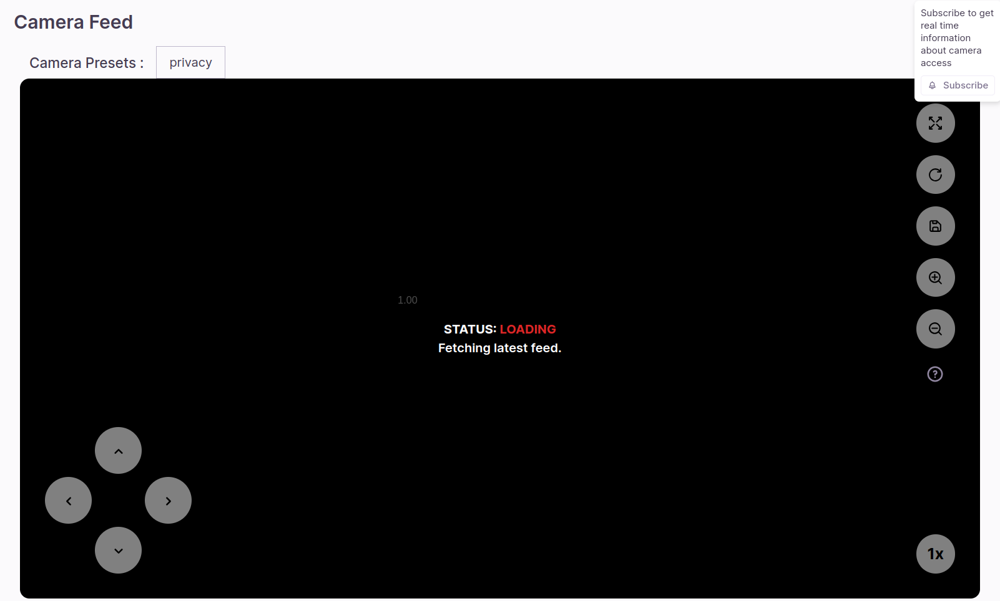
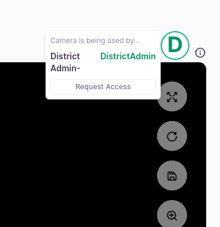
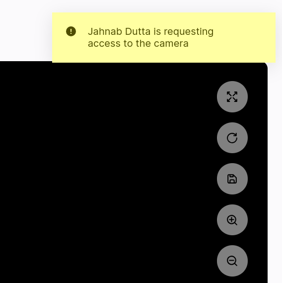

## Milestones
- [x] Add frontend for lock asset feature
- [x] Make API for requesting asset access for lock asset feature
- [x] Make frontend for requesting asset access.

## Screenshots / Videos 
- 
- 
- 

## Contributions
- ### Changes
    - Add information icon in `Feed` with option to subscribe to push notifications.
    - Add info tile to show information about current camera occupier incase the user does not have access.
    - Support to release asset when the window or tab closes or crashes.
    - Add option to request access to the asset.
    - Add backend api to send push notification to camera occupier in case of request.
    - Add notification feature to let the current camera occupier know about the request from other users.
- ### Commits
    - [Info icon for subscription to push notifications](https://github.com/coronasafe/care_fe/pull/5967/commits/bfa1fbcd17d2890faf1d3f4d6cc50cc7a35395c4)
    - [implement real time unlock-asset in frontend](https://github.com/coronasafe/care_fe/pull/5967/commits/a33dca4f834f8cac8e95d3bcf5a010ba3aec521f)
    - [Add support for locking/unlocking without push notifications (without real time)](https://github.com/coronasafe/care_fe/pull/5967/commits/2c9268c289bc621e7ebea062f63d36b48755e1c8)
    - [crash/window close support & request access](https://github.com/coronasafe/care_fe/pull/5967/commits/e88a0bb7044703fbe1cc0f94fa1680e4d3eb4791)
    - [Backend change to send push notification to camera occupier upon asset request](https://github.com/coronasafe/care/pull/1467/commits/862cebcdbda9e67e7bd17d8000fb05b0934f71fe)
## Learnings
- Learnt about new cypress test features while ideating.
- Learnt about fixing merge conflicts in github.