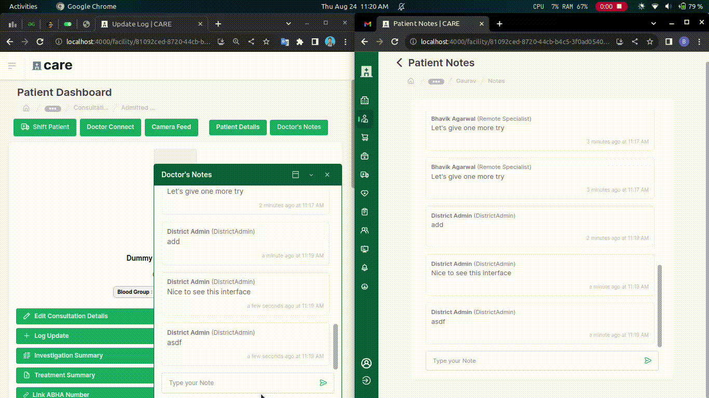

## Milestones
- [x] Made final changes in Patient Notes (UI)
- [x] Make doctor notes realtime

## Screenshots / Videos 

## Contributions
### Changes
- Doctor status and role to be stored as static attribute
- Make the chat border of remote specialist to primary colour
- Add a space between "DistrictAdmin" user id
- Add a "doctor" role type to the home facility doctor
- Generate webpush notification on patient notes addition
- Make doctor notes realtime using webpush notifications

### Pull Requests
- [https://github.com/coronasafe/care_fe/pull/6149](https://github.com/coronasafe/care_fe/pull/6149)
- [https://github.com/coronasafe/care/pull/1553](https://github.com/coronasafe/care/pull/1553)

## Learnings