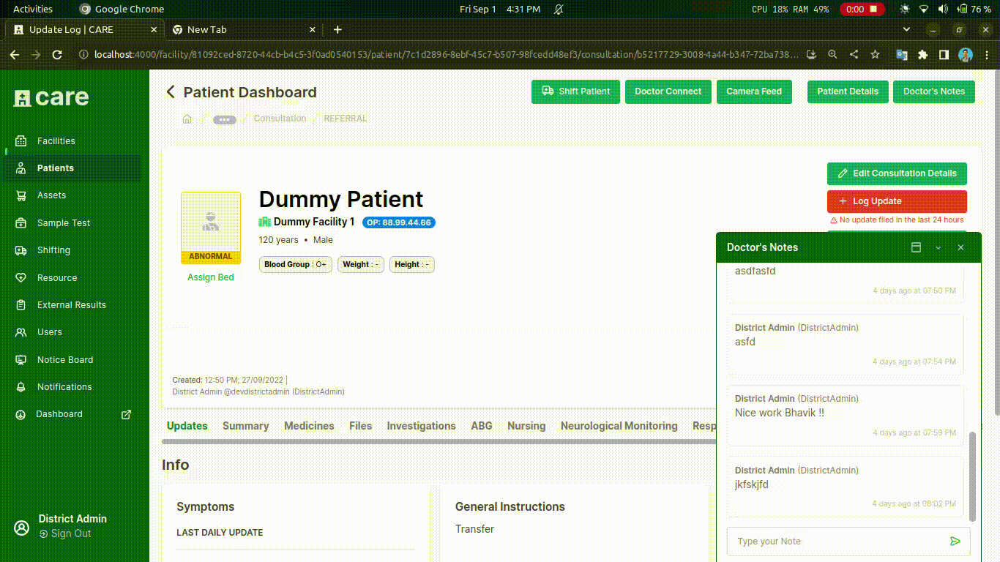
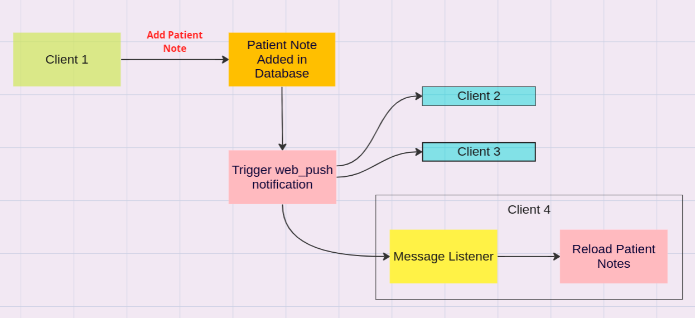

## Milestones
- [x] Make doctor notes realtime using webpush notifications
- [x] Adding notification on addition of new notes
- [x] Added documentation of the work

## Screenshots / Videos 

## Flowchart

## Contributions
### Changes
- Added a new notification event type `PATIENT_NOTE_ADDED`
- Added Real-Time Notes Updates using webpush notifications
- Added documentation - [https://github.com/orgs/coronasafe/discussions/6180](https://github.com/orgs/coronasafe/discussions/6180)

### Pull Requests
- [https://github.com/coronasafe/care_fe/pull/6149](https://github.com/coronasafe/care_fe/pull/6149)
- [https://github.com/coronasafe/care/pull/1553](https://github.com/coronasafe/care/pull/1553)

## Learnings
- Using web push notifications for making real-time updates
- Adding new notification event types