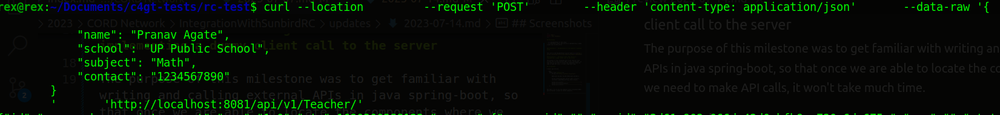
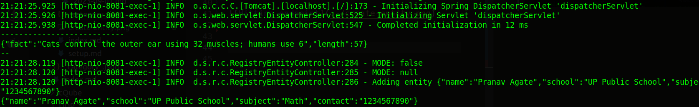

## Milestones

- [x] Documentation of the setup
- [x] Building a basic API service & implementing a dummy client call to API server


### Milestone 1 : Documentation of the SunbirdRC Core backend setup locally
 
The link to the documentation can be found [here](https://github.com/dhiway/cord/issues/163#issuecomment-1646440484)

### Milestone 2 : Building a basic API service & implementing a dummy client call to the server

The purpose of this milestone was to get familiar with writing and calling external APIs in java spring-boot, so that once we are able to locate the components where we need to make API calls, it won't take much time.

## Screenshots

A basic api-service

```bash
    public void apiHelper(){
        String url="https://catfact.ninja/fact";

        WebClient.Builder builder=WebClient.builder();

        String catfact=builder.build().get().uri(url).retrieve().bodyToMono(String.class).block();

        System.out.println("---------------------------");
        System.out.println(catfact);
        System.out.println("---------------------------");
    }
```

Now when I try to hit the endpoint http://localhost:8081/api/v1/Teacher (create an entity endpoint)



The api-service built successfully runs



## Learnings
- Writing proper documentation
- How java spring-boot application works?
- Setting up a maven project
- How API calls are made in java spring-boot application?
