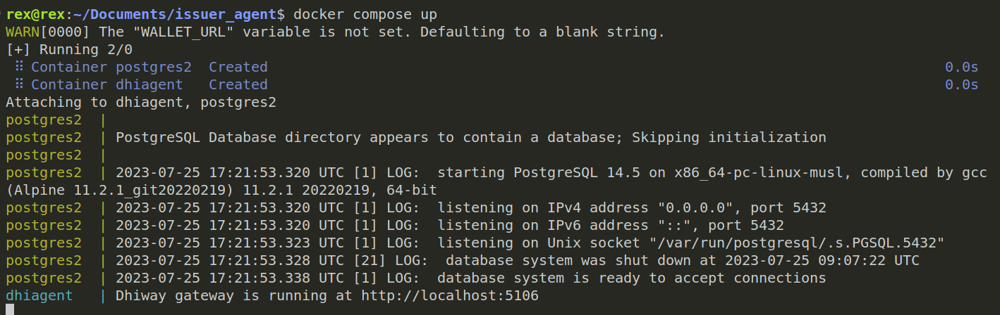

## Milestones

- [x] Setup CORD locally, and run the demos locally.
- [x] Issuer Agent setup

### Milestone 1 : Setup CORD locally, and run the demos locally

The major purpose of this milestone was to get familiar with CORD, the process of creation and verification of credentials. In order to setup CORD locally, here is the repo [link](https://github.com/dhiway/cord). Now once you have followed the documentation,and made the RUST development environment setup and ran the node in your local, in order to test it go to [apps.cord.network](https://apps.cord.network/?rpc=wss%3A%2F%2Fstaging.cord.network#/explorer) and switch to development network in order to view your node.


---

For setting up cord js sdk the repo [link](https://github.com/dhiway/cord.js)
In order to run cord js sdk, you can follow the documentation and if you want to run the node in local server then you need to have an instance of cord chain running on the machine. 

You can also use the sparknet directly.


### Milestone 2 : Issuer Agent Setup
Issuer agent has a specific set of APIs for the issuence of credential, creating schema and registries.

[Repo Link](https://github.com/dhiway/issuer-agent)

Once you have cloned the repo in your local, open it in your IDE and update the following env variables:

```bash
    CORD_WSS_URL=wss://sparknet.cord.network
    ANCHOR_URI=//Sparknet//1//Demo
    AUTHOR_URI=//Sparknet//1//Demo
```

---

We would be running the issuer agent directly on the sparknet, instead of running the local CORD node.

Once done, open the folder in the terminal window and run

```bash 
   $ docker compose up
```

The issuer agent repo is up and running on localhost:5106. You can check the docs endpoint.




## Learnings
- How CORD chain works ?
- Going through the white paper of CORD network, I learned why DIDs are important? 
- Process of creation of Decentralised identities(DID) and Verifiable Credentials(VCs)
