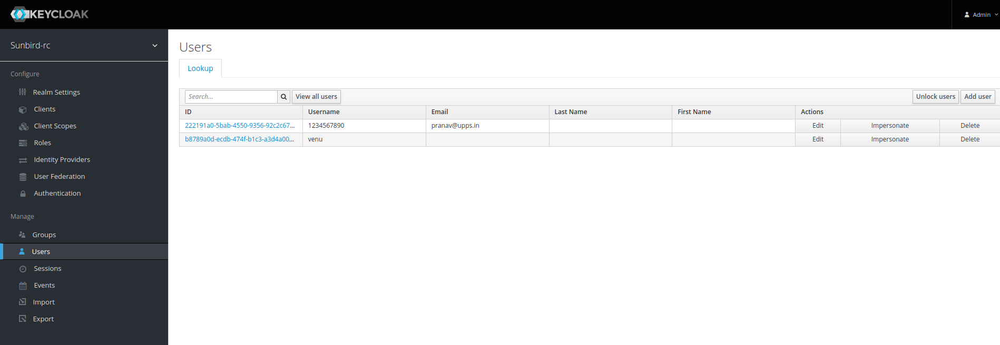
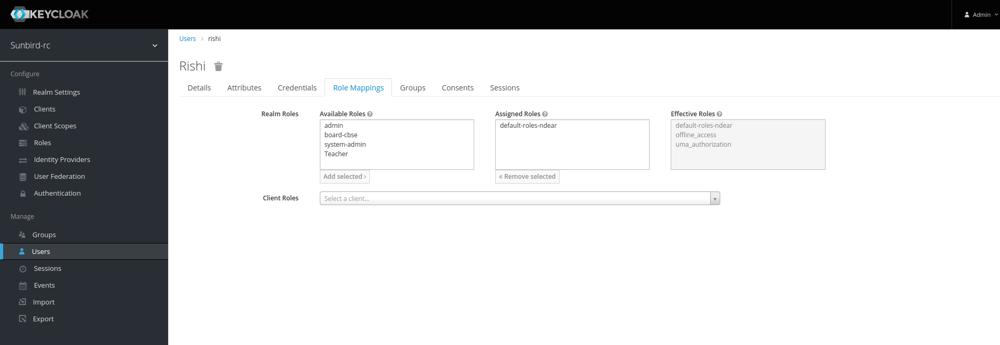

## Milestones

- [x] Setting up of keycloak and other related services

### Milestone 1 : Setting up of keycloak

This week, my major task was to make the system ready for anchoring of schemas. In order to anchor schemas, we need to first be able to create schemas in the sunbird rc via backend APIs.For that we need to be an authenticated user and must setup the keycloak configurations precisely. Not only authenticated, but in the keycloak admin console, we also need to update roles and permissions.

[Read about roles](https://docs.sunbirdrc.dev/developer-documentation/schema-configuration)

We will be creating a new user in the keycloak console and giving it a admin level privileges.

Step 1 : Starting keycloak server

```bash
    $ docker-compose up -d --no-deps keycloak
```
Step 2: Open your browser and go to the following 
link - 
```bash
    http://localhost:8080/auth/admin/master/console/
```
user-name : admin | password : admin

Step 3: Go to users and create a new user



Here you can see, I have already craeted a new user venu. You can click on  ```add user```. 
Once you have created a new user,you will be taken to this screen



Now simply add click on any role in the available roles so that they can be assigned and click on ``add selected``

A new user has been created with role admin.


In order to access the APIs, you will still be needing the access token for the particular user.

Generating keycloak access token:

```bash

    http://keycloak:8080/auth/realms/sunbird-rc/protocol/openid-connect/token

    Headers{
        "Content-Type":"application/form-encoded"
    }

    Body{
        "username":"",
        "password":"",
        "grant_type":"password",
        "client_id":"registry-frontend
    }

```

You can try this using either postman / thunderclient / or in terminal using curl/httpie.

You will recieve an access token, which we will be needing in authorization headers.

## Learnings

- Keycloak based authentication
- Entities, Schemas, Actors in the Sunbird eco system
