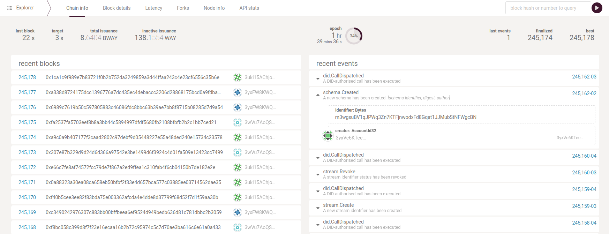
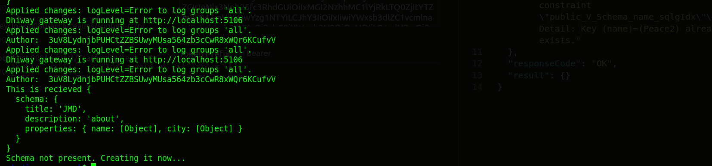

## Milestones

- [x] Anchoring Schemas to CORD network

### Milestone : Anchoring Schemas to the CORD chain

During this week, I completed one of the major milestones, i.e. anchoring schemas to the cord network.

 

## Contributions
- Anchoring schemas to cord network [#245](https://github.com/Sunbird-RC/sunbird-rc-core/pull/245)

## Learnings 
- How to work around with docker network
- serialization/deserialization of JSON data in spring boot using Jackson 
