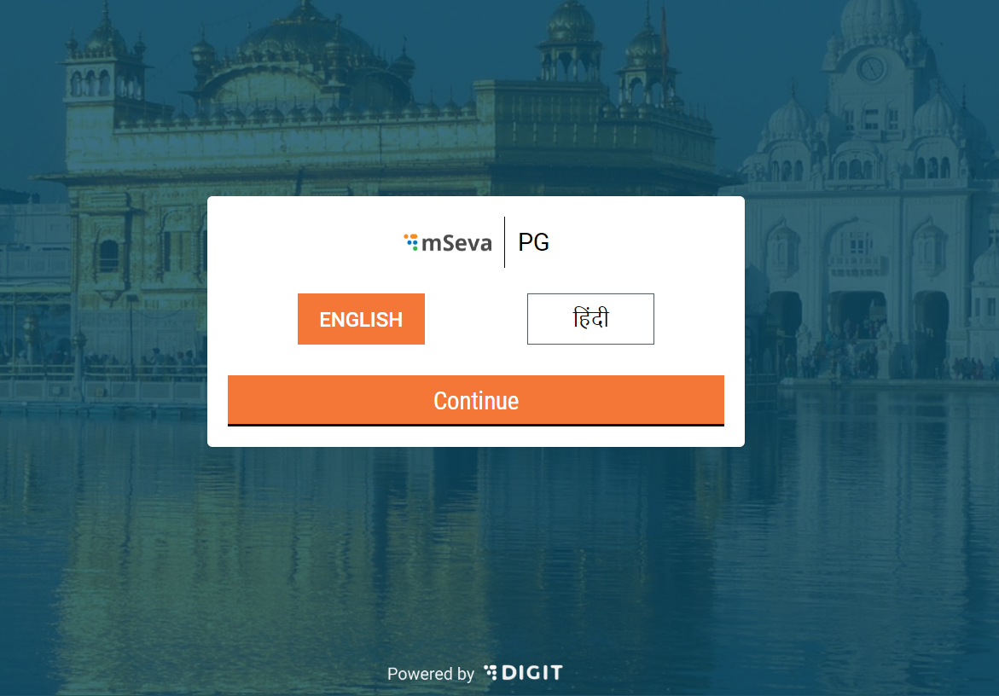
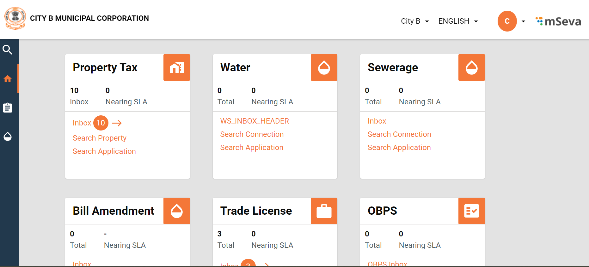
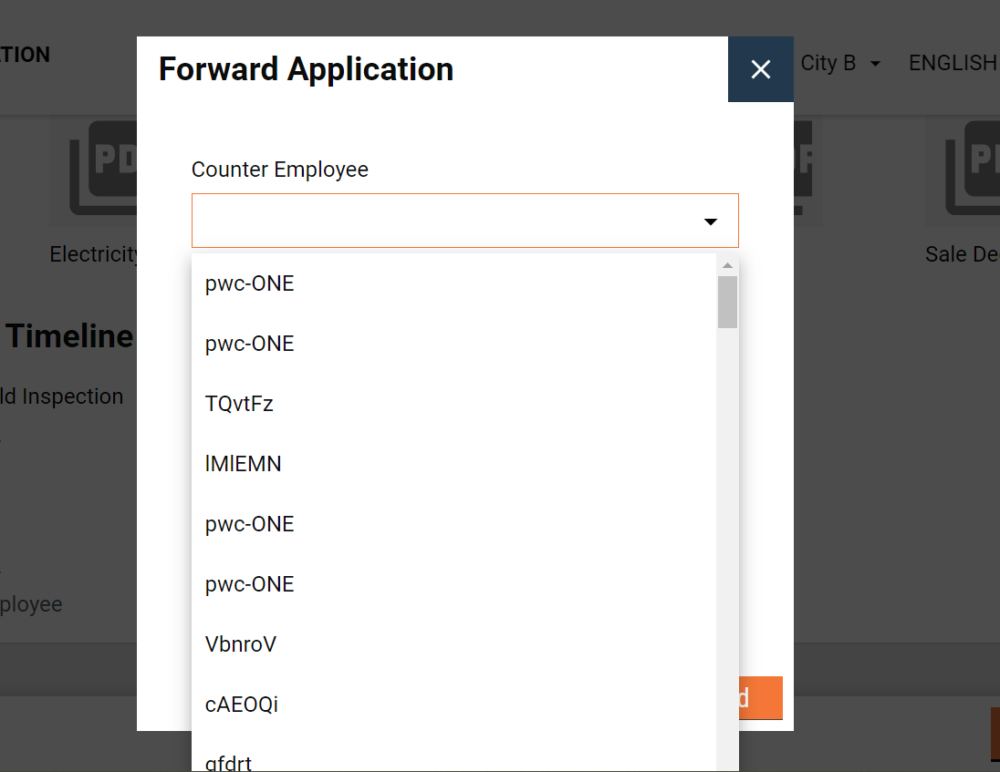
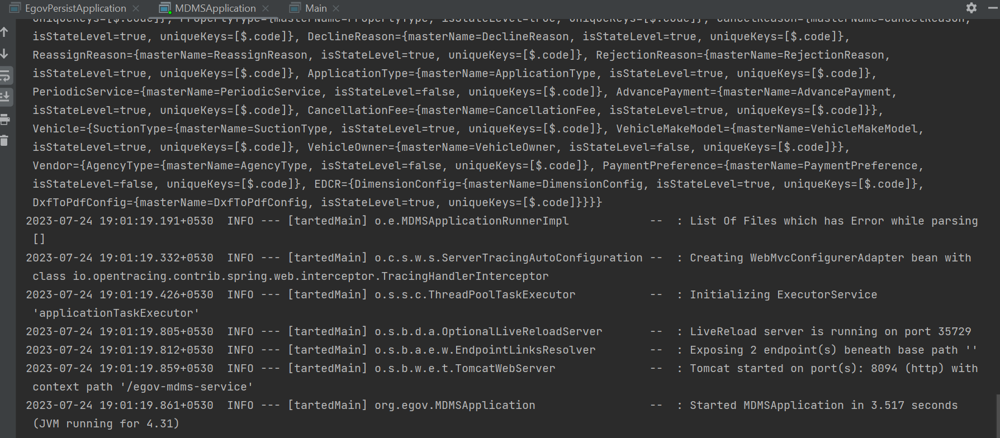
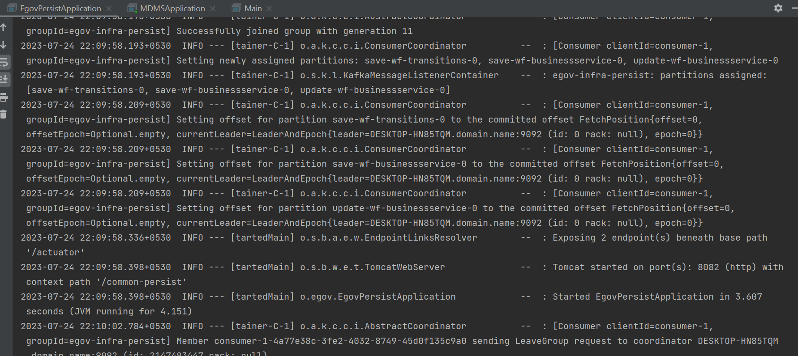

## Milestones

- [x] Raised access for staging Environment of DIGIT

  Got access to staging environment of DIGIT to try the entire user flow better. Especially to understand how the current UI links to the Backend Part.

- [x] Setting up Persister Service and MDMS Services in local

  Understood more about how Workflow Service uses MDMS and persistor services to store the required data to run. And also set them up in local.

- [x] Discussed more on the requirements and which areas to explore to implement the solution

  Currently HRMS Service stores Employees along with the City though thhere is provision to also store it at Locality or Ward Level. The roles are also only mapped to the actions an employee assigned a particular role can take. THe Workflow Service returns a list of employees that can perform a certain action when an application is submitted. Now the requirement is to return a list of all the employees mapped to a particulaar role as well as belonging to a particular locality/ward.
  Also this needs to be configurable with the help of a flag if jurisdiction is required or not. As well as different flows have different BoundaryLevels which should also be configurable.

## Screenshots / Videos

- Staging Environment understanding flow

- Current Role Based Working

- Local Service Setups

## Learnings

Documented the local set-up steps for future
