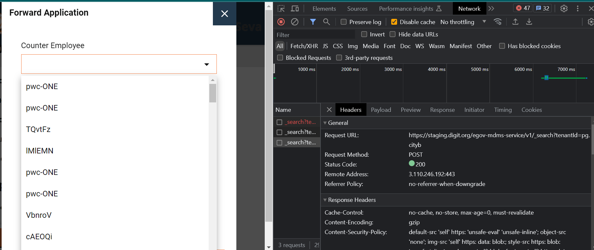
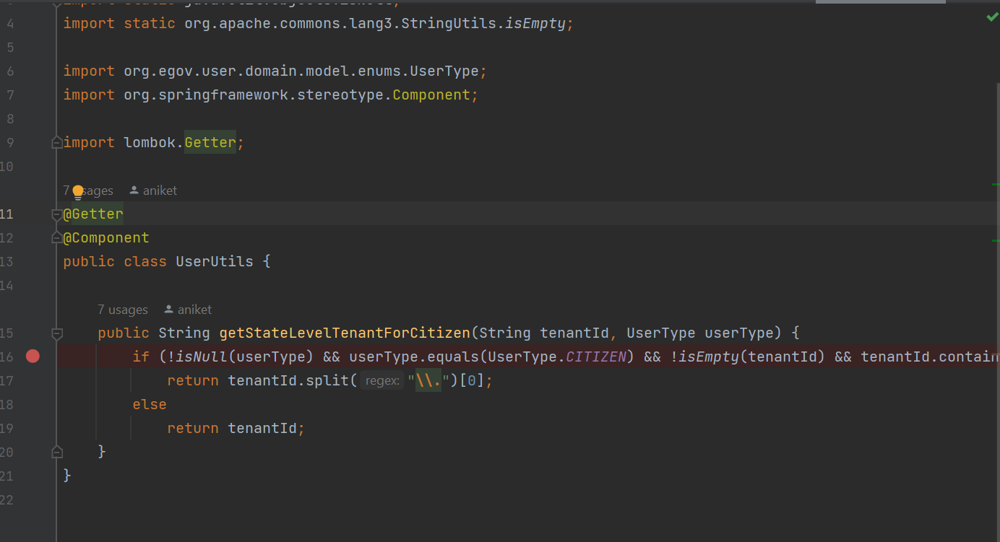
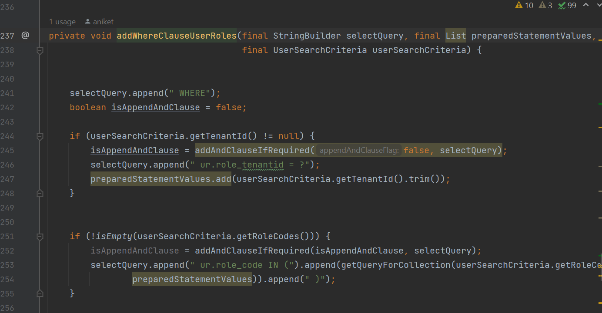

## Milestones

- [x] Code analysis to figure out where the flow

  Did the code analysis to identify which parts of the code will require a change.
  Analysis for one of the Use cases in Property Tax Application Process - When the "Take Action" button is clicked and the list of employees is returned it makes a POST call to the HRMSService API which then calls EmployeeService and finally the UserService where the SELECT query filters based on the role & city( TenantID). The API call sends the City(Ward) in the RequestBody of the URL which can also be added in the filtering.

## Screenshots / Videos

- Inspecting the API calls from staging environment front end
  The endpoint path - /egov-hrms/employees/_search?tenantId=pg.cityb&roles=CITIZEN,PT_CEMP,SYSTEM_PAYMENT,SYSTEM&isActive=true&_=1690387714195
  So here in tenantId pb.city2, city2 is the ward-level

  

- Code Analysis screenshots of the classes where changes should be made

  UserUtils to get the WardID from the URL RequestBody

  

  The method in which the WHERE clause of the SELECT statement is prepared
  

## Contributions

## Learnings
