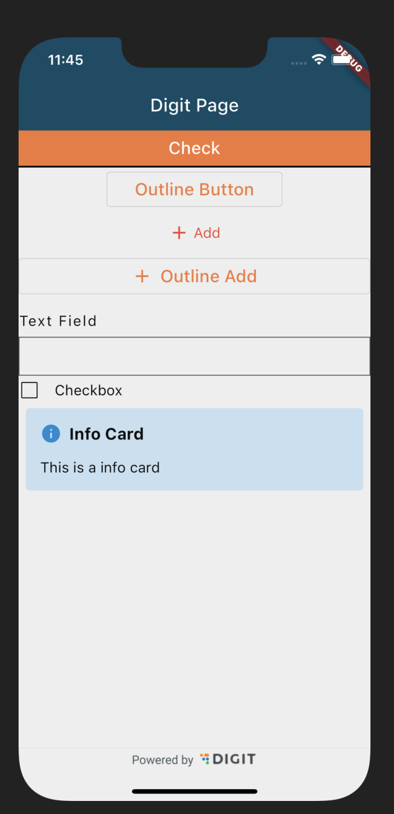

## Milestones
- Setting up the codebase and added necessary commands in the Makefile
I was given the task to check out the already built product and see how it works for the first week. Later I added some important function and classes for my flutter app like an HTTP wrapper class, Local Storage class, etc. I also added some commands in the Makefile to make the development process easier like making files for a new screen, running the app, etc. This makes the app more modular and also maintains a consistency in the codebase.

## Screenshots / Videos 
In the first week, I wasnt directly working on the UI part of the app so there aernt many screenshots to show. But I have added some screenshots of the app in the second week. I did try out the Digit UI package which is supposed to be used in the app. This package is being maintained by the Digit team and is available on pub.dev. I have added some screenshots of the app using the package.

## Contributions
As my app is built from the ground up, I am currently maintaining a single branch for the app and it doesnt have any PR.
Here are some commits that I have made in the first week:
- https://github.com/achintya-7/egov-rnd/commit/443acaf7084976096f862da6190396f015628422
- https://github.com/achintya-7/egov-rnd/commit/f5a7a70baedd314de527d6365df860cdb13929fc

## Learnings
I learnt about the GetX in the first week and how to leverage it for MVC style development