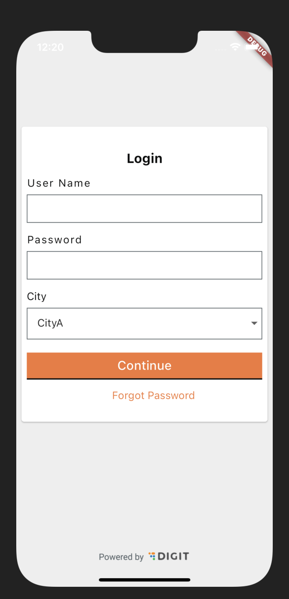
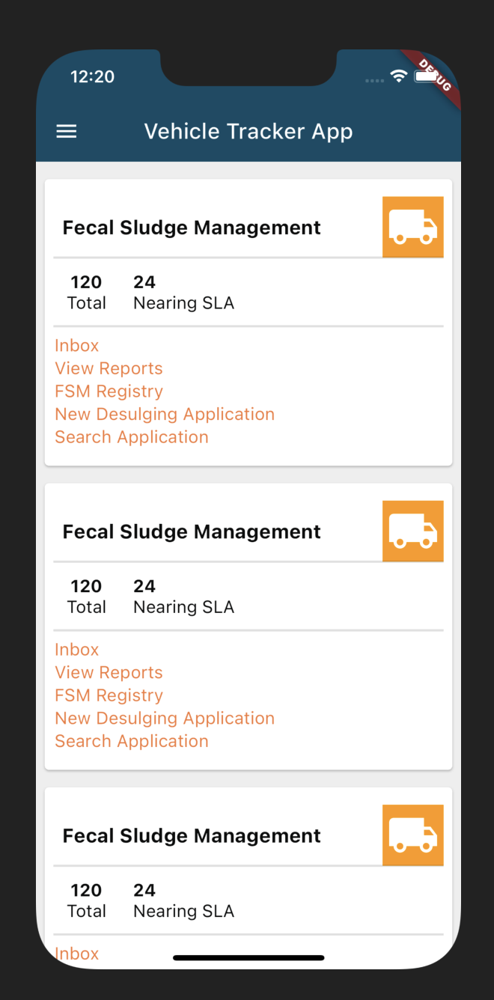
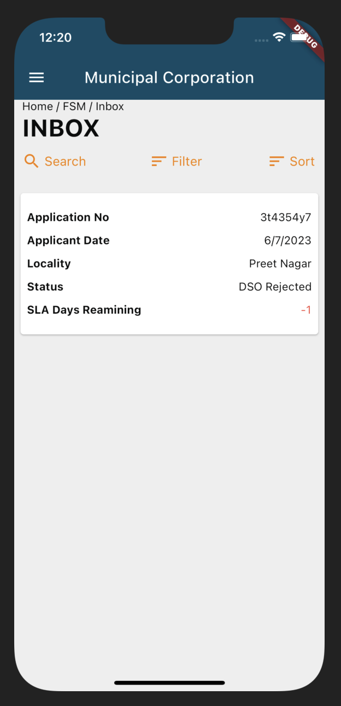
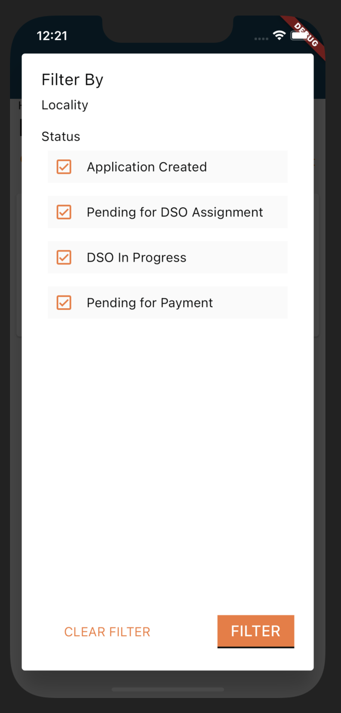

## Milestones
- Added the UI for the login and inbox screen
This week my mentor asked me to work on the Inbox page. I took the general inspiration from the React app which is already built. For the basic design and theme, I used the Digit UI package which ended up saving a lot of time and effort. This helped me in focusing more on the Bussiness logic and State Management of the app.

## Screenshots / Videos 

| Login Screen | Home Screen |
| --- | --- |
|  |  |

| Inbox Screen | Query Filter |
| --- | --- |
|  |  |

## Contributions
Here are some major commits that I have made in the second week:
- https://github.com/achintya-7/egov-rnd/commit/acc74f5d5056204d4ce3eea30667a898506a0256
- https://github.com/achintya-7/egov-rnd/commit/7c5e81f394141cd46d5d7165fbd60313985bc5a1
- https://github.com/achintya-7/egov-rnd/commit/4a26d200b93b37ddabc77893fd13b4dd5876b5d2

## Learnings
- Learnt about OBX() and GetBuilder() in GetX and how to use them for state management. Also learnt about the GetX navigation and how to use it for navigation between screens.
- Also got to know about Time.Periodic() in Dart which is used to run a function periodically.