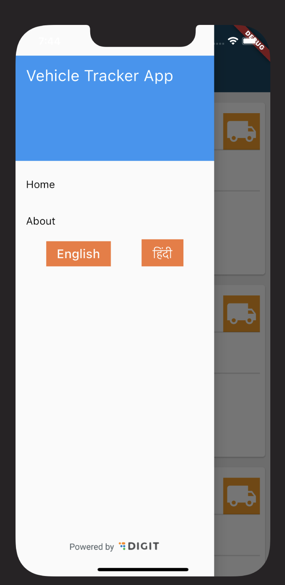
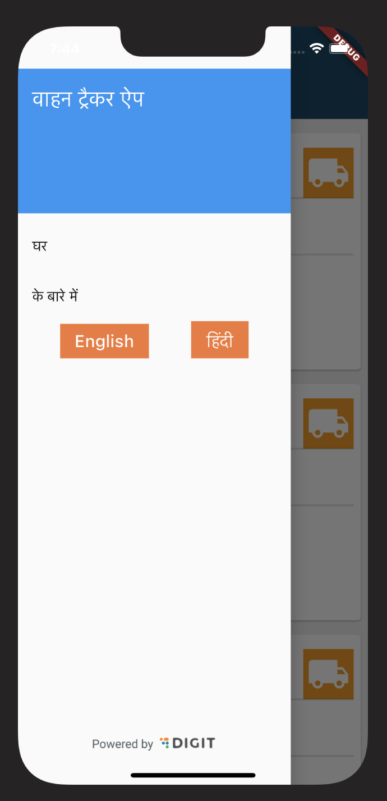
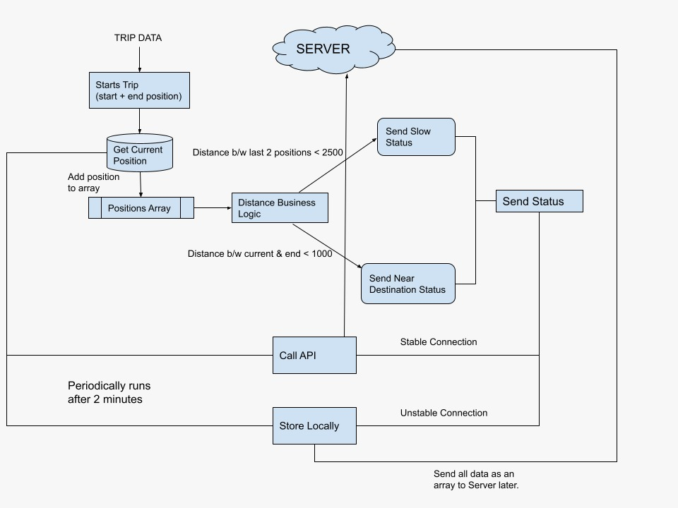

## Milestones
- Added Internationlization support for the app
The app will now support two languages. English and Hindi.
- Implemented the Vehicle Tracking feature
- Added support for login and token secured storage

## Screenshots / Videos 
For i18n, I have only added some general texts in Hindi. The rest of the texts will be added later on after the approval from my mentor. Here are some screenshots of the app in English and Hindi:

| English | Hindi |
| --- | --- |
|  |  |

The Vehicle Tracking is one of the main feature of the app. It will help the user to track the vehicle to monitor illegal activities. Currently, the feature is in the development phase and will be completed in the next week. As of now I have only developed some of it and have tested it out with an android emulator by mimicking the location. Here is a flow diagram of the feature:

## Contributions
Here are some major commits that I have made in the third week:
- [Tested Vehicle Tracking in emulator](https://github.com/achintya-7/egov-rnd/commit/e4a92d6f1511ae278da6f47b58bac1fbdc3ccc65)
- [I18n](https://github.com/achintya-7/egov-rnd/commit/aea3b457254c5281280a316a5456098c60589746)
- [Login](https://github.com/achintya-7/egov-rnd/commit/8af69b483918b2715e9695a9d419f833af30ba93)

PR
- [Init PR](https://github.com/egovernments/egov-rnd/pull/6)

## Learnings
- Learnt about the GetX Internationalization and how to use it for localization of the app.
- Learnt about the Geolocator package in Flutter and how to use it for getting the location of the device.
- Learmt about Secure Storage in Flutter and how to use it for storing the token securely.