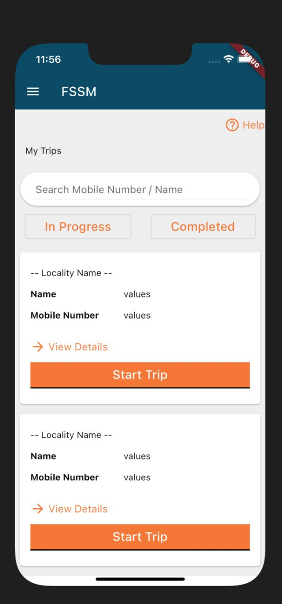
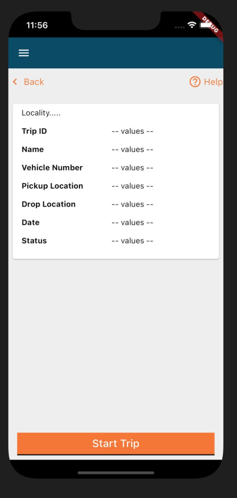

## Milestones
- [x] Added I18N via API and stored it in local storage
- [x] Added MDMS via API and stored it in local storage
- [x] Completed Home and Detail Info Screen

## Screenshots / Videos 
There were some changes in the figma design so I have remade/modified some of my previous screens.

| Home | Detail |
| --- | --- |
|  |  |

## Contributions
- [Init Setup for API calls](https://github.com/egovernments/egov-rnd/commit/44119722cd9e45315094d5eb8647b57d994e91e6)
- [Added Service Class for API and Local Storage](https://github.com/egovernments/egov-rnd/commit/443acaf7084976096f862da6190396f015628422)

## Learnings
- Learned about how to use Hive database
- Learned about how to use freezed for Json object creation
