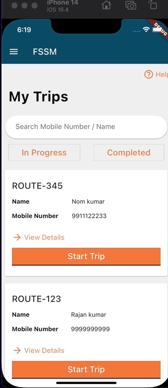

## Milestones
- [x] Added API integration for Trip Info
- [x] Added local search feature in app on name and phone number

## Screenshots / Videos 
The main task of this week was to add the API integration in app for home screen.

It fetches all the trip info of the user by using its userId. 

After that, user can query the all those trips by typing on the search bar

## Contributions
https://github.com/egovernments/egov-rnd/pull/6

## Learnings
- Freezed Json object creation
- Hive database
- API integration in flutter