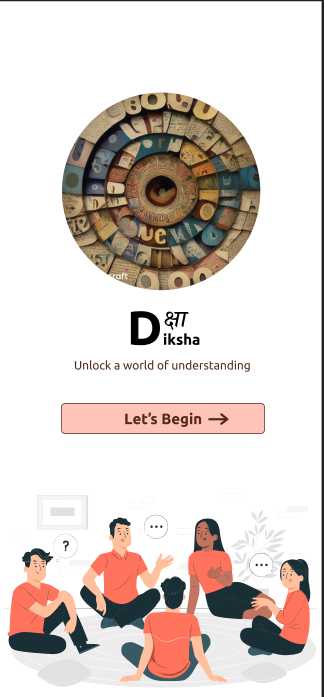

## Milestones

- Studied Figma
- Started working on the design for the UI of the plugin
- Worked on the types of input required (i.e. typing, uploading, referring to existing text)
- Created the wireframe for the plugin.
- Worked on the design.

## Screenshots / Videos

- 
## Contributions

- https://www.figma.com/file/f43Silx7EFHUIR7hK20KFV/Untitled?type=design&node-id=0%3A1&mode=design&t=yyFkfU6cmKTbzV8r-1

## Learnings

- Got a deeper understanding of how wireframes and mockups work.
- Experimented with various color palettes 
- Made changes according to feedbacks received and further redefined the designs.
