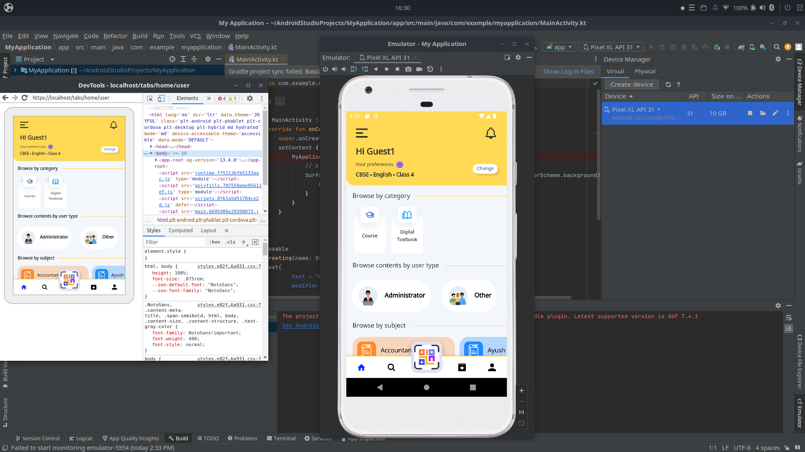

## Milestones
- [x] Forked the Sunbird ED App repository
- [x] Completed the local machine setup to run Sunbird Ed on a local environment.
- [x] Gained insights into the functionality and workings of Sunbird Ed by running the application locally
- [x] Set up all the necessary dependencies required to run Sunbird Ed on the local machine

## Screenshots / Videos 

## Contributions
Forked Repo: https://github.com/bruno-noir/SunbirdEd-mobile-app

## Learnings
- **Forked the Sunbird ED App repository:**
   By forking the Sunbird ED App repository, I created a personal copy of the project, allowing me to work on it independently without affecting the original codebase. This also enabled me to contribute to the project and keep track of changes made to it.

- **Completed the local machine setup to run Sunbird Ed on a local environment:**
   During this milestone, I successfully set up the required environment on my local machine to run Sunbird Ed. This involved installing and configuring necessary tools, dependencies, and runtime environments, ensuring a smooth and functional setup.

- **Gained insights into the functionality and workings of Sunbird Ed by running the application locally:**
   Running Sunbird Ed on my local environment provided firsthand experience with the application's functionalities and behavior. This allowed me to explore its features, understand its user interface, and observe how different components interact with each other.

- **Set up all the necessary dependencies required to run Sunbird Ed on the local machine:**
   By configuring and installing all the required dependencies, I ensured that Sunbird Ed runs efficiently on my local setup. This included managing libraries, databases, and other tools necessary for the application to function properly.

