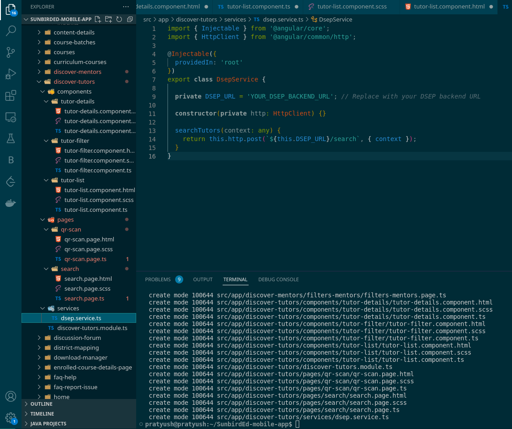

## Milestones
- [x] Implemented UI changes based on requirements, enhancing the user interface
- [x] Rebuilt the app entirely using the command "ionic cordova build android," integrating essential updates.
- [x] Added several new components within the src/app folder to enhance app functionality.

## Screenshots / Videos 

## Contributions

## Learnings
-  Achieved a comprehensive understanding of the app's codebase through the rebuilding process.
-  Successfully relearned both Angular and Ionic frameworks in a practical context.
