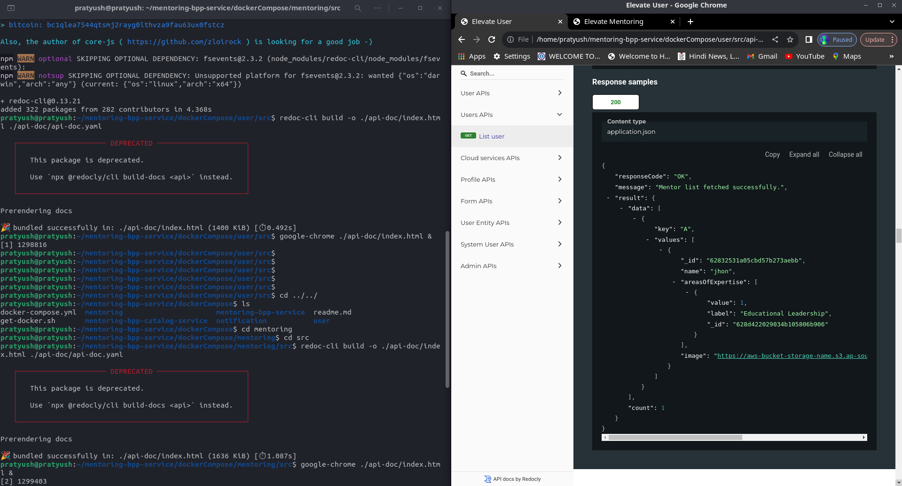
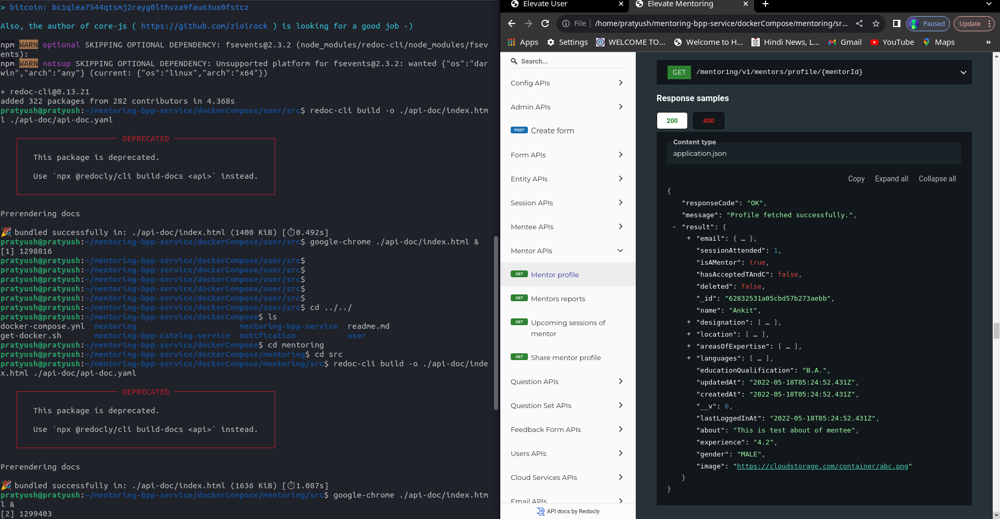

## Milestones
- [x] Explored the Mentor Ed API to understand its structure and functionalities.
- [x] Deprecated the api-doc.yaml file in both user and mentoring repositories.
- [x] Found the API endpoints associated with the mentor list, mentor profile and more.
## Screenshots / Videos 

## Contributions

## Learnings
