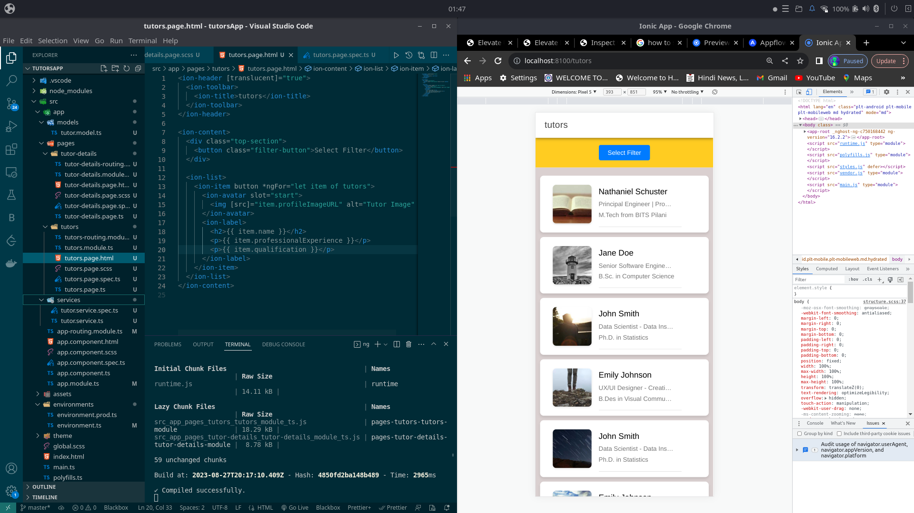
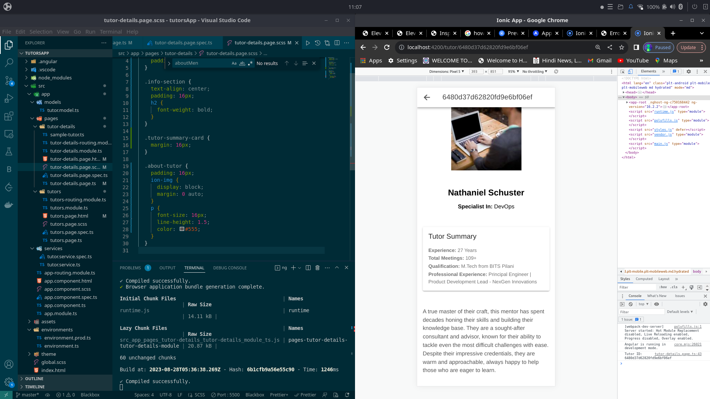
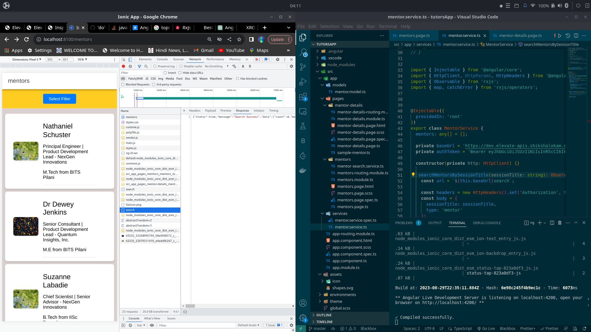
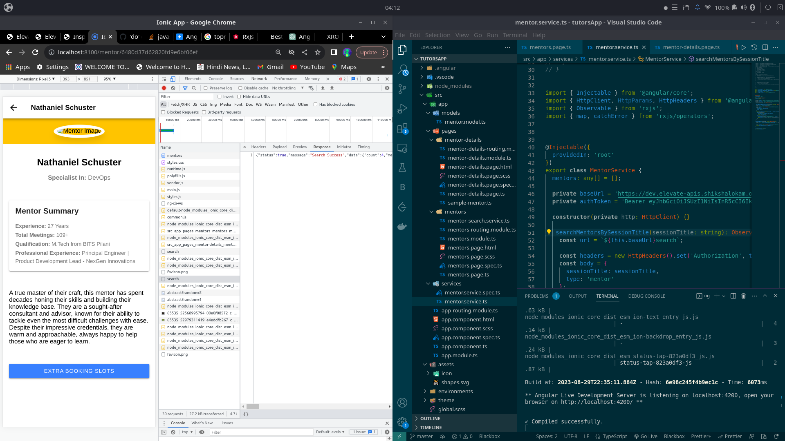
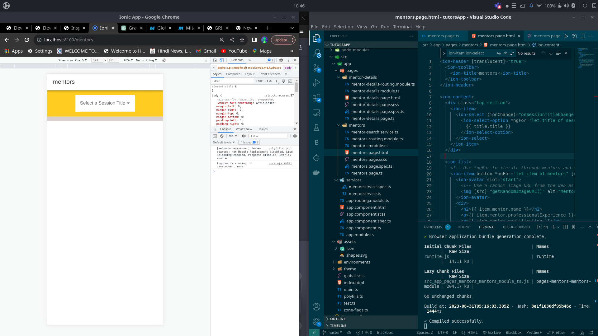
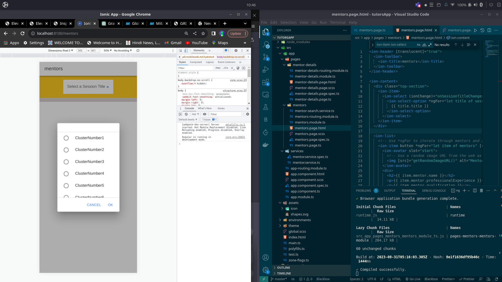
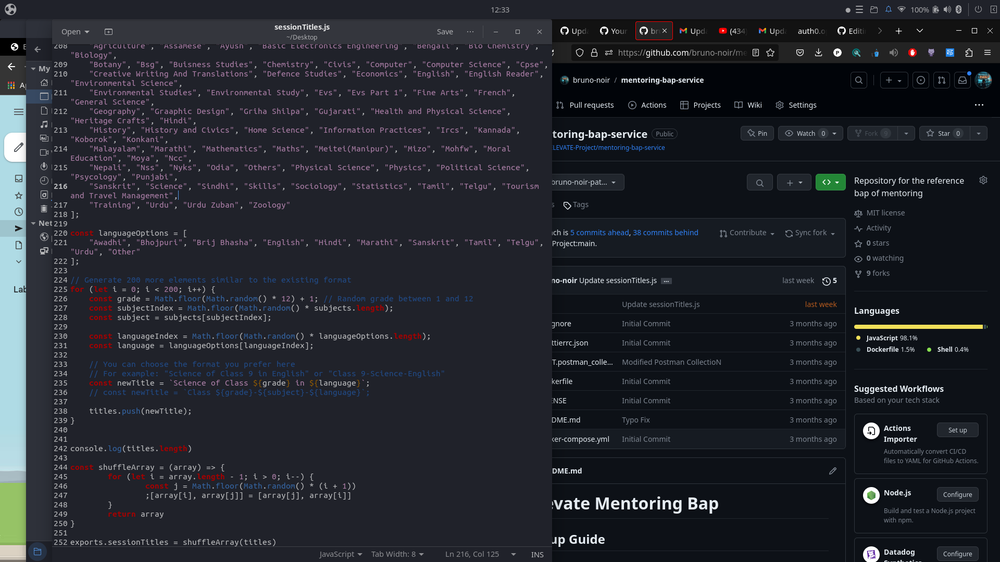

## Milestones
- [x] Developed the front-end and back-end components
- [x] Created a sample list of tutors and tutor details, populating the database.
- [x] Integrated the POST Search Mentors by Session Titles functionality.
- [x] Added a radio button on the search page to choose the Session Title.
- [x] Implemented functionality to update the tutor list based on the selected Session Title.
- [x] Changed sessionTitles.js file
## Screenshots / Videos 
  

## Learnings
-Full Stack Development: I gained experience in developing both the front-end and back-end components of a web application. This allowed me to understand the intricacies of connecting user interfaces with server-side logic.

-Database Population: I successfully created and populated a database with sample tutor information. This hands-on experience in database management was invaluable and will be useful in future projects.

-API Integration: Integrating the POST Search Mentors by Session Titles functionality taught me how to work with external APIs, enabling me to fetch and display data dynamically based on user input.

-User Interface Enhancement: The addition of radio buttons for selecting Session Titles and the dynamic update of the tutor list based on user choices improved the overall user experience. This taught me the importance of user-friendly design and responsiveness in web development.
