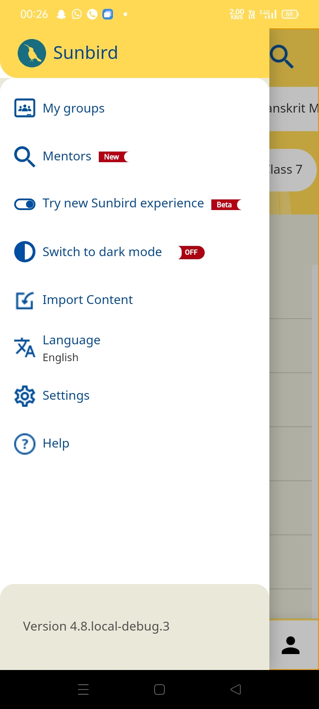
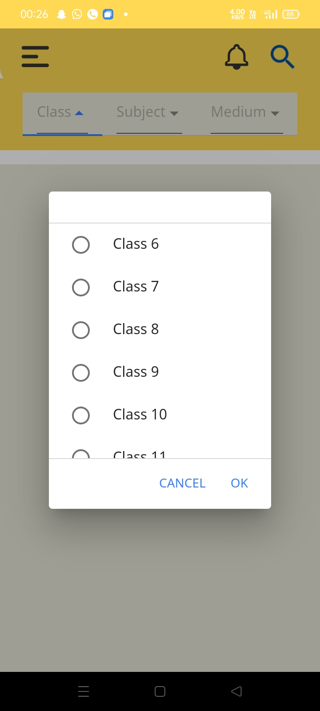
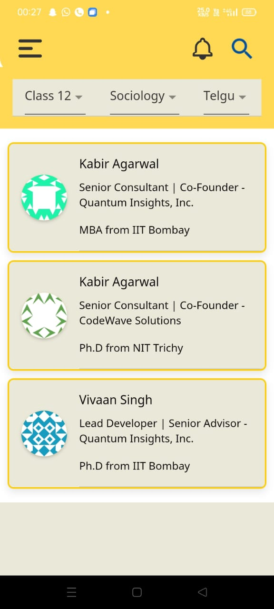
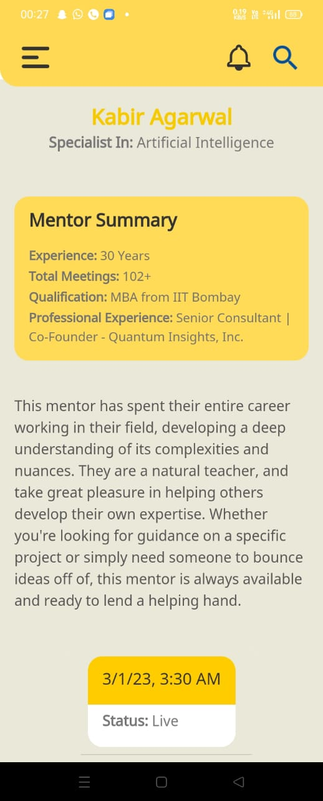

## Milestones
- [x] Implemented the backend API for searching mentors by session title
- [x] Developed frontend functionality to fetch and display a list of tutors based on class, subject, and medium selections
- [x] Enhanced tutor profiles by including detailed information about each tutor and their available slots
- [x] Successfully integrated the backend API with the frontend user interface, ensuring seamless communication.

## Screenshots / Videos
 

 

## Contributions
- Utilized the [tutorsApp](https://github.com/bruno-noir/tutorsApp) repository to track and manage changes made to the tutor list and tutor details pages. This repository facilitated experimentation with the Post Search API.
- Made the following commits in the `c4gt` branch of the [SunbirdEd-mobile-app repository](https://github.com/bruno-noir/SunbirdEd-mobile-app/tree/c4gt):
  - `4ebce6faf`: Finished adding tutor search feature
  - `edad06967`: Done implementing the search feature
  - `6c8b5584a`: Added Class-Subject-Medium search for mentors
  - `506f39840`: Added session details
  - `e71427528` (c4gt2): Added mentors/mentor-details pages
  - `43773311c`: Going to remove discover-tutors folder
  - `bfd7c81dc` (temp): Test drive 2
  - `e06acf451`: Added tutor-details folder
  - `db74f0c69`: Added mentors-search folder and modified codes
- ([https://docs.google.com/document/d/1AIOZYTKnlumGm75VzgYHhftKgfzl4_OJps8ubXKIIvg/edit?usp=sharing](url)) Documentation of the feature

## Learnings
- Gained experience in designing and creating APIs to fetch data based on specific search criteria
- Improved frontend development skills and learned how to make API requests and handle responses
- Expanded knowledge of data modeling and how to present complex information in user profiles
- Gained expertise in full-stack development, connecting backend and frontend components
