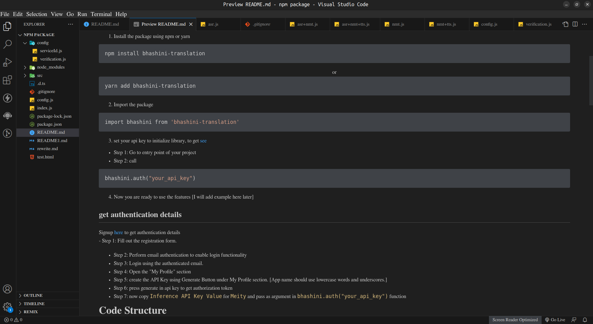

## Milestones
- [X] document npm library 
- [X] Became familiar with the Anuvaad API.
- [X] Integrated Anuvaad API into Postman.

## Screenshots / Videos 

<!-- ## Contributions -->

## Learnings 
- Writing better documentation by providing clear explanations, usage examples, and comprehensive details on functions, configuration options, and best practices for improved understanding and maintenance.